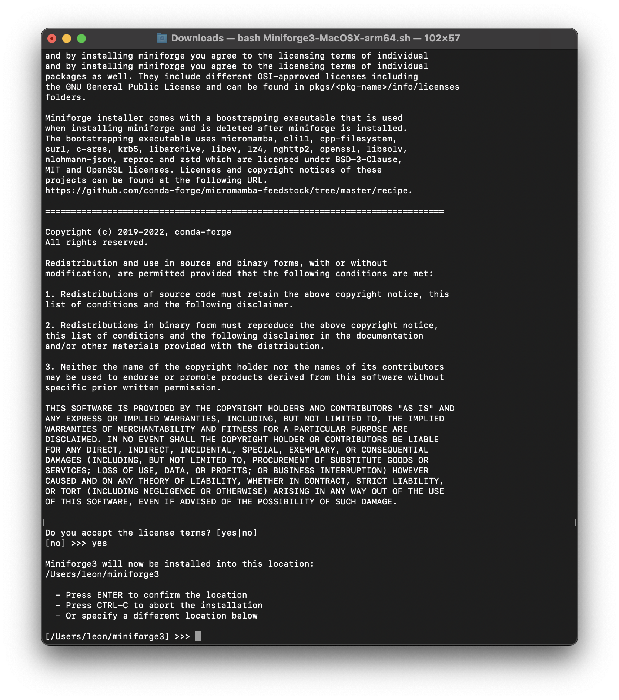
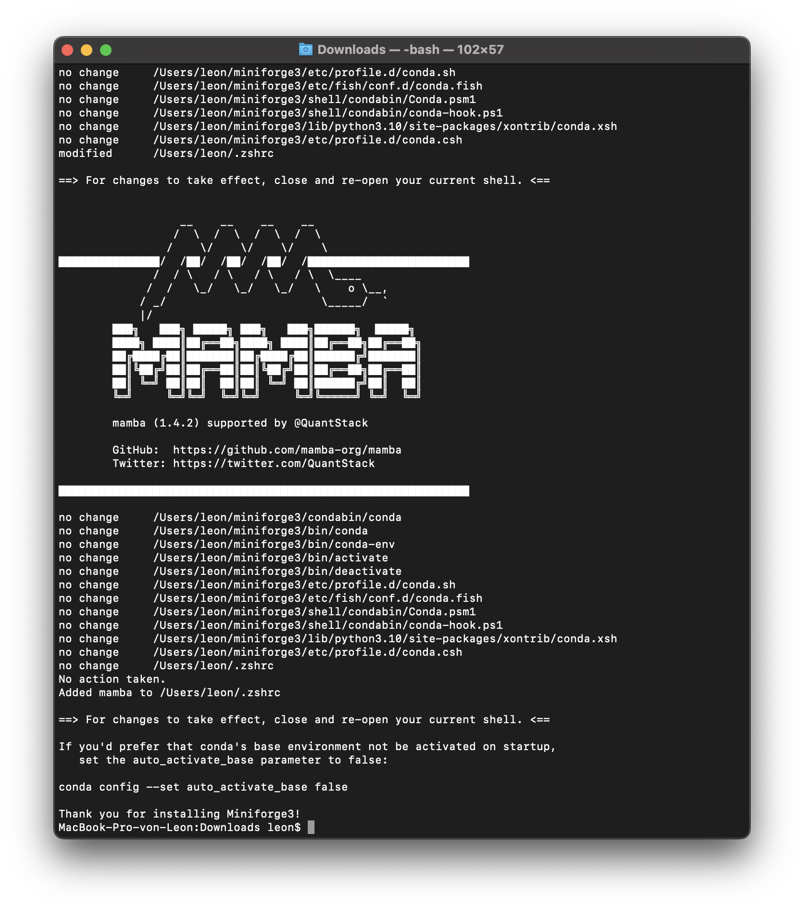
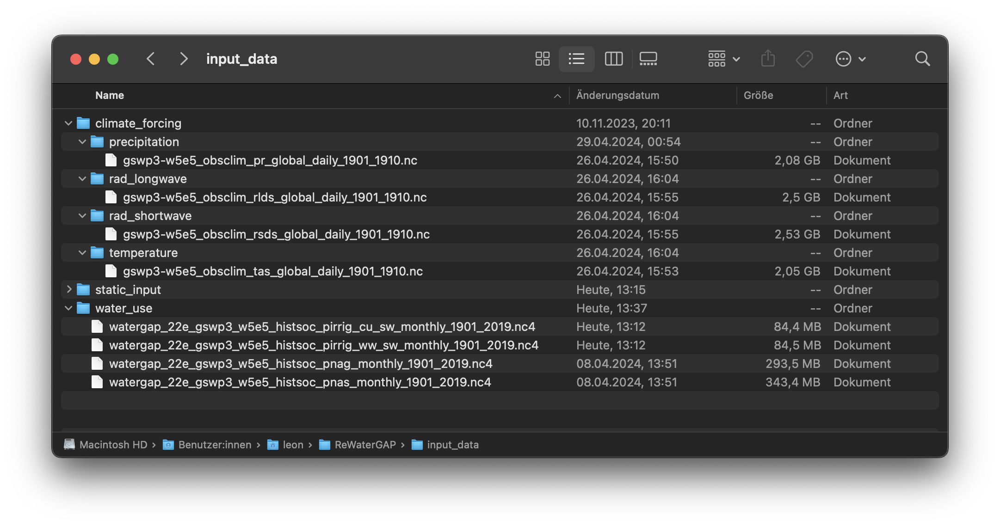
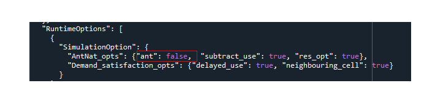

.. _five_minute_guide:

5 minute guide to WaterGAP
--------------------------

**1: Download and Install Python** (Skip this step if python is already installed)
	
Download the current Python version for your OS from `the official Python Website <https://www.python.org/downloads/>`__ and install.

**2: Download and Install the package manager "Mamba"** (Skip this step if mamba is already installed)
	
Go to the `Mamba Website <https://github.com/conda-forge/miniforge>`__ , choose your OS (Linux or MacOS) and download the installation file (the downloaded file has an ".sh" extension)
	
	
Open your terminal and navigate to the downloaded file (it has the name "Miniforge3-(OSname)-(architecture).sh")

Install Mamba by running the following command and follow the installation prompts. The prompt will notify you where to install Mamba (see :ref:`image <mamba_licence_location>` below). The created folder will be called "miniforge3".

.. code-block:: bash
		
	$ bash Miniforge3-MacOSX-arm64.sh (example for MacOS Apple Silicon)

.. _mamba_licence_location:

After the installation is complete, you will see the :ref:`Mamba logo <installation_complete>` .

.. _installation_complete:

Navigate to the "bin" folder in the newly created "miniforge3" folder.

.. code-block:: bash

	$ cd /Users/leon/miniforge3/bin (example for MacOS Apple Silicon)
	
	Activate mamba by running the following command

.. code-block:: bash

		$ source activate

**3: Clone the WaterGAP repository**

Using the Terminal, navigate to the directory of choice where the WaterGAP folder will be copied into. Then use the following command to clone the repository.

.. code-block:: bash

		git clone https://github.com/HydrologyFrankfurt/ReWaterGAP.git

Find more information in the official GitHub documentation `here <https://docs.github.com/en/get-started/quickstart/fork-a-repo#cloning-your-forked-repository>`__ .

**4: Create an environment to run ReWaterGAP in**

Navigate to the ReWaterGAP folder in the terminal using the following command.

.. code-block:: bash

	$ cd user/…/ReWaterGAP
	

Create an environment (e.g. with the name "watergap") and install the required packages from the requirements.txt file by running the following command.

.. code-block:: bash

	example
	$ mamba create --name watergap --file requirements.txt

Activate the WaterGAP environment using the following command.

.. code-block:: bash

	example
	$ mamba activate watergap

**5. Get Input Data**

The User should provide the following data in NetCDF format.  

Note: WaterGAP operates with daily temporal resolution. The model does consider leap days (29th February) in computations, so these *specific days* should be excluded from the climate forcings. 
Additionally, water use data (potential net abstractions) is provided in monthly timesteps, and thus, it's assumed in WaterGAP that the potential net abstractions per day in a month are the same.

Climate Forcing (Daily data)
	- precipitation (kg m-2 s-1)
	- downward longwave radiation (Wm-2)
	- downward shortwave radiation (Wm-2)
	- temperature (K)
	
Water Use  (Monthly data)
	- potential consumptive use from irrigation (m3/month)
	- potential water withdrawal use from irrigation (m3/month)
	- potential net abstractions from surface water (m3/month)
	- potential net abstractions from groundwater (m3/month)

The files need to be copied to their respective folders in ../ReWaterGAP/input_data (see picture):

You can find the necessary climate forcing data at `ISIMIP <https://data.isimip.org/search/tree/ISIMIP3b/SecondaryInputData/climate/atmosphere/mri-esm2-0/>`__ 
and the water use data at  *link here soon*.

.. _naturalized_run:

**6: Run WaterGAP using the configuration file „Config_ReWaterGAP.json“ - Naturalized run**

Note:  For the Naturalised run, make sure that anthropogenic run is set to false (**"ant": false**) in the **Config_ReWaterGAP.json** file (see image below).
See :ref:`Tutorials <tutorials>` to run other model configurations.

Finally run the command below

.. code-block:: bash

	$ python3 run_watergap.py Config_ReWaterGAP.json
