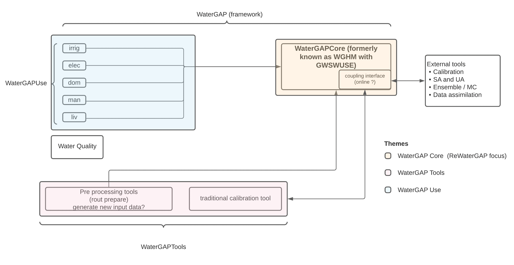

.. _getting_started:

===============
Getting started
===============

Introduction
------------

WaterGAP is a state-of-the-art global-scale water resource and water-use simulation model. 
WaterGAP was used to support the sustainable development of the Earth system by assessing water scarcity for humans, drought hazards, ecologically-relevant streamflow characteristics, the impacts of human water use and dam construction as well as freshwater-related scenarios of the future [1]_. 
Recent focus has been on quantifying the impact of climate change on the global freshwater system, including the streamflow regime, groundwater recharge, floods, and droughts. 
WaterGAP is an open-source software with the aim of increasing reproducibility among researchers.

WaterGAP has been generally categorized into two sections: 

#. **WaterGAP framework** which consists of:
  
   * *WaterGAPUse* which includes the five sectoral water use models. 
   
   * *WaterGapCore* which includes the linking model Groundwater-Surface Water Use (GWSWUSE) and the WaterGAP Global Hydrology Model (WGHM).

#. **WaterGAPTools** consisting of *pre-processing* (input-generation) and *standard calibration* (against mean annual streamflow).

   
   *WaterGAP Components*

5 minute guide to WaterGAP
--------------------------

1: **Download and Install Python** (if already installed skip this step)
	Download the current Python version for your OS from `the official Python Website <https://www.python.org/downloads/>`__and install.

2: **Download and Install Mamba** (if already installed skip this step)
	Go to the `Mamba Website <Miniforge3<https://github.com/conda-forge/miniforge>`__, choose your OS (Linux or MacOS) and download the file. (downloaded file has .sh extension)
	Navigate in Terminal to sh file you downloaded
	Install by running and following the instructions

.. code-block:: bash
		
	$ bash Miniforge3-$(uname)-$(uname -m).sh
		
	example: $ bash Miniforge3-MacOSX-arm64.sh (for mac os Apple Silicon)

Navigate to bin folder in minifoge

.. code-block:: bash

	example: $ cd /Users/leon/miniforge3/bin
	
Activate mamba by running

.. code-block:: bash

		$ source activate

3: **Clone the WaterGAP repository**

Using the Terminal, navigate to the directory of choice where the WaterGAP folder will be copied into. Then 

.. code-block:: bash

		git clone https://github.com/HydrologyFrankfurt/ReWaterGAP.git

Find more information in the official GitHub documentation `here <Miniforge3<https://docs.github.com/en/get-started/quickstart/fork-a-repo#cloning-your-forked-repository>`__:

4: **Navigate to the ReWaterGAP folder in the terminal**

.. code-block:: bash

	$ cd user/…/ReWaterGAP
	
5: **Create an environment to run ReWaterGAP in**
	Create an environment (e.g. with the name "watergap") and install the required packages from the requirements.txt file.

.. code-block:: bash

	example
	$ mamba create --name watergap --file requirements.txt

6: Activate the WaterGAP environment
 	
	example
	$ mamba activate watergap

7. **Import Data**

8: **Run WaterGAP using the configuration file „Config_ReWaterGAP.json“ - Naturalized run**

.. code-block:: bash

	$ python3 run_watergap.py Config_ReWaterGAP.json
	
	

References 
----------
.. [1] Müller Schmied, H., Cáceres, D., Eisner, S., Flörke, M., Herbert, C., Niemann, C., Peiris, T. A., Popat, E., Portmann, F. T., Reinecke, R., Schumacher, M., Shadkam, S., Telteu, C.E., Trautmann, T., & Döll, P. (2021). The global water resources and use model WaterGAP v2.2d: model description and evaluation. Geoscientific Model Development, 14(2), 1037–1079. https://doi.org/10.5194/gmd-14-1037-2021
