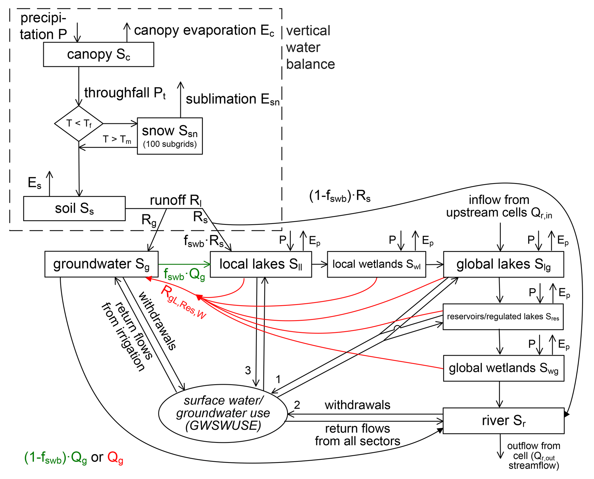

.. _getting_started:

===============
Getting started
===============

Introduction
------------

WaterGAP is a state-of-the-art global-scale water resource and water-use simulation model. 
WaterGAP was used to support the sustainable development of the Earth system by assessing water scarcity for humans, drought hazards, ecologically-relevant streamflow characteristics, the impacts of human water use and dam construction as well as freshwater-related scenarios of the future [1]_. 
Recent focus has been on quantifying the impact of climate change on the global freshwater system, including the streamflow regime, groundwater recharge, floods, and droughts. 
WaterGAP is an open-source software with the aim of increasing reproducibility among researchers.

Model Framework
---------------
WaterGAP 2 is composed of global water use models, the linking model Groundwater-Surface Water Use (GWSWUSE), and the WaterGAP Global Hydrology Model (WGHM) (see :ref:`Figure 1 <Figure1_framework>`).

Five global water use models, including irrigation, calculate consumptive use (CU) and water withdrawal use (WU) [1]_. Consumptive water use refers to the part of the withdrawn (or abstracted) water that evapotranspirates during use [1]_.

GWSWUSE distinguishes water use from groundwater and surface water, generating monthly time series of net abstractions (NApot,s and NApot,g) from the two sources [1]_. These time series are input into the WGHM, impacting daily water flows and storages globally.
For a detailed information on the WaterGap Framework see the `associated publication <https://gmd.copernicus.org/articles/14/1037/2021/#section2>`__.

.. _Figure1_framework:

<Figure 1 here>

	*Figure 1: The WaterGAP 2.2d framework with its water use models and the linking module GWSWUSE that provides potential net water abstraction from groundwater and surface water as input to the WaterGAP Global Hydrology Model (WGHM). Figure adapted from Müller Schmied et al. (2014).*

Water Use Models and GWSWUSE (Linking Model)
++++++++++++++++++++++++++++++++++++++++++++

For more information on the water use models see the `associated publication <https://gmd.copernicus.org/articles/14/1037/2021/#section3>`__.

WaterGAP Global Hydrology Model (WGHM)
++++++++++++++++++++++++++++++++++++++

The WaterGAP Global Hydrology Model is developed based on the schematic [1]_ presented below. 

   
   *Schematic of WGHM in WaterGAP 2.2d: Boxes represent water storage compartments, and arrows represent water flows. Green (red) color indicates processes that occur only in grid cells with humid ((semi)arid) climate*

**Model processes**

Processes are categorized as vertical water balance and lateral water balance

:ref:`Vertical Water balance <vertical_water_balance>`
	- Canopy
	- Snow
	- Soil

:ref:`Lateral Water balance <lateral_water_balance>`
	- Groundwater
	- Lakes and Wetland Storage
	- Reservoirs and regulated lakes
	- Rivers
	- Water Abstractions

.. note::
	Lateral routing of water through the storage compartments is based on the so-called fractional routing scheme and differs between (semi)arid and humid grid cells [1]_.

5 minute guide to WaterGAP
--------------------------

**1: Download and Install Python** (Skip this step if python is already installed)
	
Download the current Python version for your OS from `the official Python Website <https://www.python.org/downloads/>`__ and install.

**2: Download and Install the package manager "Mamba"** (Skip this step if mamba is already installed)
	
Go to the `Mamba Website <https://github.com/conda-forge/miniforge>`__ , choose your OS (Linux or MacOS) and download the installation file (the downloaded file has an ".sh" extension)
	
	
Open your terminal and navigate to the downloaded file (it has the name "Miniforge3-(OSname)-(architecture).sh")
	
	
Install Mamba by running the following command and follow the installation prompts. The prompt will notify you where to install Mamba (see :ref:`image <mamba_licence_location>` below). The created folder will be called "miniforge3".

.. code-block:: bash
		
	$ bash Miniforge3-MacOSX-arm64.sh (example for MacOS Apple Silicon)

.. _mamba_licence_location:

.. figure:: ../images/getting_started/mamba_licence_location.png

After the installation is complete, you will see the :ref:`Mamba logo <installation_complete>` .

.. _installation_complete:

.. figure:: ../images/getting_started/installation_complete.png

Navigate to the "bin" folder in the newly created "miniforge3" folder.

.. code-block:: bash

	$ cd /Users/leon/miniforge3/bin (example for MacOS Apple Silicon)
	
	Activate mamba by running the following command

.. code-block:: bash

		$ source activate

**3: Clone the WaterGAP repository**

Using the Terminal, navigate to the directory of choice where the WaterGAP folder will be copied into. Then use the following command to clone the repository.

.. code-block:: bash

		git clone https://github.com/HydrologyFrankfurt/ReWaterGAP.git

Find more information in the official GitHub documentation `here <https://docs.github.com/en/get-started/quickstart/fork-a-repo#cloning-your-forked-repository>`__ .

**4: Create an environment to run ReWaterGAP in**

Navigate to the ReWaterGAP folder in the terminal using the following command.

.. code-block:: bash

	$ cd user/…/ReWaterGAP
	

	Create an environment (e.g. with the name "watergap") and install the required packages from the requirements.txt file by running the following command.

.. code-block:: bash

	example
	$ mamba create --name watergap --file requirements.txt

	Activate the WaterGAP environment using the following command.

.. code-block:: bash

	example
	$ mamba activate watergap

**5. Get Input Data**

The following data should be provided by the User in NetCDF format:

Climate Forcing
	- precipitation
	- longwave radiation
	- shortwave radiation
	- temperature

Water Use
	- potential consumptive use from irrigation (monthly)
	- potential water withdrawal use from irrigation (monthly)
	- potential net abstractions from surface water (monthly)
	- potential net abstractions from groundwater (monthly)

The files need to be copied to their respective folders in ../ReWaterGAP/input_data (see picture):

.. figure:: ../images/getting_started/input_data.png

You can find the necessary climate forcing data at `ISIMIP <https://data.isimip.org/search/tree/ISIMIP3b/SecondaryInputData/climate/atmosphere/mri-esm2-0/>`__ .

**6: Run WaterGAP using the configuration file „Config_ReWaterGAP.json“ - Naturalized run**

.. code-block:: bash

	$ python3 run_watergap.py Config_ReWaterGAP.json
	

Acknowledgement of funding
--------------------------
ReWaterGap receives funding from the German Research Foundation (DFG). For further information, see the official project description `here <https://gepris.dfg.de/gepris/projekt/443183317?language=en>`__. 	

References 
----------
.. [1] Müller Schmied, H., Cáceres, D., Eisner, S., Flörke, M., Herbert, C., Niemann, C., Peiris, T. A., Popat, E., Portmann, F. T., Reinecke, R., Schumacher, M., Shadkam, S., Telteu, C.E., Trautmann, T., & Döll, P. (2021). The global water resources and use model WaterGAP v2.2d: model description and evaluation. Geoscientific Model Development, 14(2), 1037–1079. https://doi.org/10.5194/gmd-14-1037-2021
