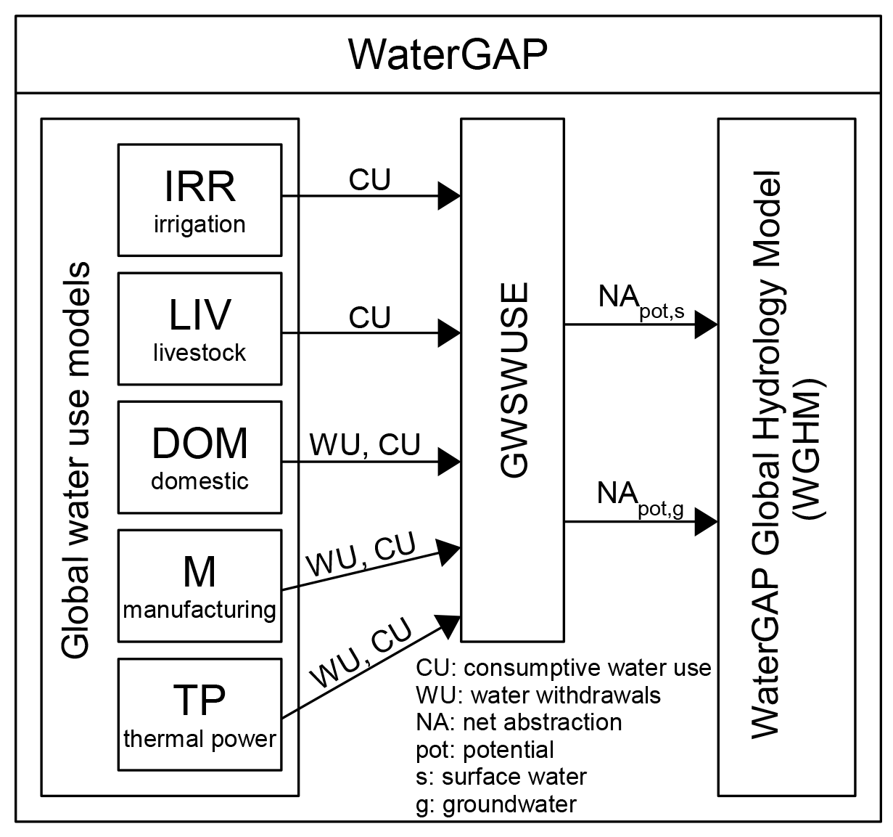
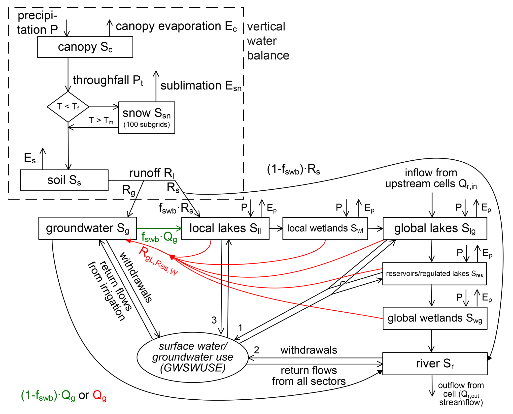

Model Framework
---------------
WaterGAP 2 is composed of global water use models, the linking model Groundwater-Surface Water Use (GWSWUSE), and the WaterGAP Global Hydrology Model (WGHM) (see :ref:`Figure 1 <Figure1_framework>`).

Five global water use models, including irrigation, calculate consumptive use (CU) and water withdrawal use (WU) [1]_. Consumptive water use refers to the part of the withdrawn (or abstracted) water that evapotranspirates during use [1]_.

GWSWUSE distinguishes water use from groundwater and surface water, generating monthly time series of net abstractions (NApot,s and NApot,g) from the two sources [1]_. These time series are input into the WGHM, impacting daily water flows and storages globally.
For a detailed information on the WaterGap Framework see the `associated publication <https://gmd.copernicus.org/articles/14/1037/2021/#section2>`__.

.. _Figure1_framework:

	*Figure 1: The WaterGAP 2.2d framework with its water use models and the linking module GWSWUSE that provides potential net water abstraction from groundwater and surface water as input to the WaterGAP Global Hydrology Model (WGHM). Figure adapted from Müller Schmied et al. (2014).*

Water Use Models and GWSWUSE (Linking Model)
++++++++++++++++++++++++++++++++++++++++++++

For more information on the water use models see the `associated publication <https://gmd.copernicus.org/articles/14/1037/2021/#section3>`__.

WaterGAP Global Hydrology Model (WGHM)
++++++++++++++++++++++++++++++++++++++

The WaterGAP Global Hydrology Model is developed based on the schematic [1]_ presented below. 

   
   *Figure 2: Schematic of WGHM in WaterGAP 2.2d: Boxes represent water storage compartments, and arrows represent water flows. Green (red) color indicates processes that occur only in grid cells with humid ((semi)arid) climate*

**Model processes**

Processes are categorized as vertical water balance and lateral water balance

:ref:`Vertical Water balance <vertical_water_balance>`
	- Canopy
	- Snow
	- Soil

:ref:`Lateral Water balance <lateral_water_balance>`
	- Groundwater
	- Lakes and Wetland Storage
	- Reservoirs and regulated lakes
	- Rivers
	- Water Abstractions

.. note::
	Lateral routing of water through the storage compartments is based on the so-called fractional routing scheme and differs between (semi)arid and humid grid cells [1]_.

References 
----------
.. [1] Müller Schmied, H., Cáceres, D., Eisner, S., Flörke, M., Herbert, C., Niemann, C., Peiris, T. A., Popat, E., Portmann, F. T., Reinecke, R., Schumacher, M., Shadkam, S., Telteu, C.E., Trautmann, T., & Döll, P. (2021). The global water resources and use model WaterGAP v2.2d: model description and evaluation. Geoscientific Model Development, 14(2), 1037–1079. https://doi.org/10.5194/gmd-14-1037-2021
