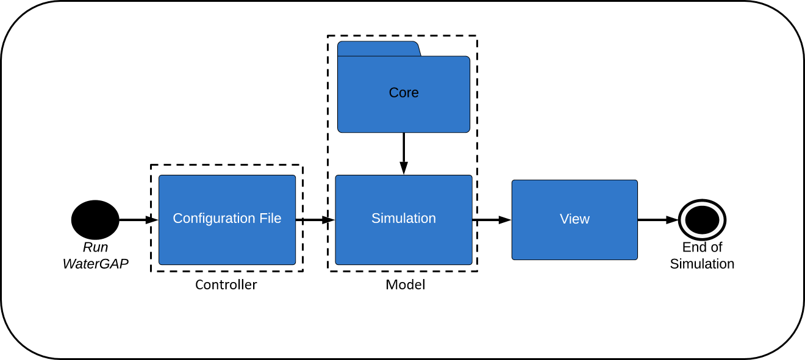

Model Architecture
==================
WaterGap is structured using the model controller view software architectural pattern [1]_. This pattern is chosen since it improves the software's organization via separating the software components into three parts namely: 

- *Model*: Responsible for managing data and logic (hydrological processes in WaterGAP) of the software. 
- *Controller*: Controls the data flow into model and updates the view whenever data changes.
- *View*: Visualize the data the model outputs in desired format.  

This separation of concerns not only makes WaterGAP maintainable and extensible but also reduces coupling whiles increasing cohesion among WaterGAP components. 

.. class:: center

MVC is implemented in WaterGAP as shown in Figure 1. WaterGAP is started or run based on a configuration setting module  which is the *controller* component of the software. This module contains the paths to input data (eg. meteorological forcing, model files such as routing data, etc), runtime options (simulation period, time-step configuration), output variables and path to output files. The simulation module then initialize the settings from the configuration file and calls the core package  for computations of hydrological processes based on the defined settings. The simulation module and core package constitute the  the *model* component of the software. Finally the *view* component views results from the model in the required format.

   
   *WaterGAP MVC Pattern*

References 
----------
.. [1] Gamma, E., Helm, R., Johnson, R., & Vlissides, J. (1994). Design patterns: Elements of reusable object-oriented software. Addison Wesley.

