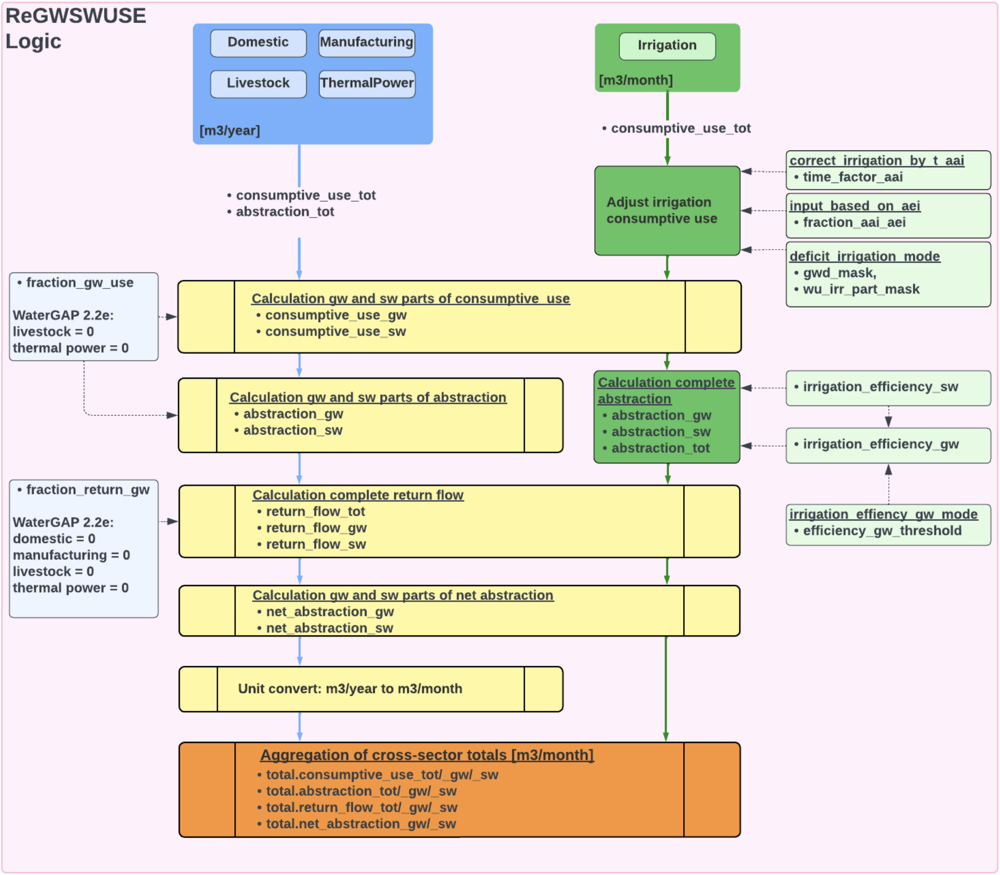

.. _simulation_logic_gwswuse:

################
Simulation Logic
################

The simulation logic is the core of the ReGWSWUSE software. This chapter describes in detail the simulation logic of the ReGWSWUSE software, which is used for modeling water use across various sectors. It includes the calculation processes and the underlying formulas.

********
Overview
********

ReGWSWUSE, the WaterUseModels, and the WaterGAP Global Hydrological Model (WGHM) are integral sub-models of the comprehensive WaterGAP model. While the WaterUseModels model water use in various sectors—such as irrigation, households, industry, thermal power, and livestock—they do not differentiate between groundwater (GW) and surface water (SW). This differentiation, along with the subsequent calculation of net abstractions, is a central task of ReGWSWUSE, allowing for the quantification of human impact on global water resources.

ReGWSWUSE links the water use data from the WaterUseModels with the hydrological model (WGHM) by breaking down the data and calculating the shares of consumptive use, withdrawals, returns, and net abstractions for groundwater and surface water bodies in each sector. The main tasks include:

- **Consumptive Use:** ReGWSWUSE differentiates the sector-specific consumptive uses of freshwater calculated in the WaterUseModels by splitting it into groundwater and surface water. This division is based on the relative shares specified for each sector.
- **Withdrawals:** The software calculates water withdrawals from groundwater and surface water for all sectors. Specific irrigation efficiencies are used for irrigation, and then the total water withdrawal for irrigation is calculated. These calculations are essential for determining the actual amount of water withdrawn from the respective water sources.
- **Returns:** Another central feature of ReGWSWUSE is the calculation of returns of excess water to groundwater and surface water bodies. These returns occur when a portion of the withdrawn water is not consumed and flows back into the water compartments of groundwater and surface water.
- **Net Abstractions:** Finally, ReGWSWUSE calculates net abstractions, which represent the difference between water withdrawals and returns—essentially the actual amount of water lost to the water resource due to human water use. These net abstractions are a crucial variable for estimating human impact on water resources.

After calculating the sector-specific water use data, this data is integrated into ReGWSWUSE to determine consumptive use, withdrawals, returns, and net abstractions across all sectors. These aggregated values are essential for the global analysis of water use and are incorporated into the hydrological model (WGHM).

Through these processes, ReGWSWUSE connects the sectoral water use models (WaterUseModels) with the hydrological model (WGHM) of WaterGAP. The results from ReGWSWUSE feed directly into WGHM, where they are used to model water flows, storage processes, and the impact of human activities on water resources at a global level.

***************************
Sector-Specific Simulations
***************************

In the sector-specific simulations, consumptive use, water withdrawals, returns, and net abstractions are calculated individually for groundwater and surface water resources for each sector. There are differences in assumptions and calculation processes within WaterGAP that vary by sector.

While the sectors of households, industry, thermal power plants, and livestock differ only in their assumptions about certain variables and do not show sector-specific differences in the simulations, the irrigation sector is distinctly different. It not only has a different simulation logic but also a finer temporal resolution. In the WaterGAP model, it is assumed that potential water use remains constant throughout the year for the mentioned sectors (households, industry, thermal power, and livestock). In contrast, the irrigation sector takes into account that water use varies from month to month.

Additionally, water withdrawals for irrigation in ReGWSWUSE are calculated fully considering the different irrigation efficiencies for the withdrawal infrastructures of groundwater and surface water. Optional functions are also available, allowing for flexible adjustments of consumptive water use in the irrigation sector. 

   
   *Figure 1: In the Figure, all calculation steps of the ReGWSWUSE software are illustrated, starting from the sector-specific input data to the aggregation of cross-sectoral results. It is shown that for the sectors of households, industry, thermal power plants, and livestock, the consumptive use and water withdrawals are input in the unit m³/year. For irrigation, only the consumptive use is input, specifically in the unit m³/month.*

Calculation of GW and SW Parts of Consumptive Use
#################################################

The first calculation step performed for all sectors is the calculation of consumptive use of groundwater and surface water using time-invariant raster data on the sector-specific relative share of groundwater use (fraction_gw_use). The sector-specific consumptive uses (consumptive_use_tot) are multiplied by the relative shares of groundwater use to obtain the consumptive use of groundwater per sector. Subsequently, the consumptive groundwater use is subtracted from the total consumptive use on a cell-by-cell basis to derive the consumptive use of surface water per sector. In WaterGAP 2.2e, it is assumed that the livestock and thermal power plant sectors rely exclusively on surface water.

Adjust Consumptive Use in Irrigation
####################################
Before this step is conducted, the input consumptive use for irrigation is modified. This modification consists of three optional steps that can be set through configuration.

The first modification can be used when the input consumptive use refers to areas equipped for irrigation (AEI) and the irrigation results should pertain to actually irrigated areas (AAI). When this configuration is enabled ("input_based_on_aei": True), the consumptive use is multiplied by the annual relative shares of AAI to AEI (fraction_aai_aei). The annual fraction_aai_aei values are country-specific and generated based on time series of national AAI and AEI from AQUASTAT.

The second modification (configuration: correct_irr_simulation_by_t_aai: True) serves to correct the consumptive use for irrigation for the years 2016 to 2020 using a time factor (time_factor_aai) based on the temporal development of AAI since 2015. This modification is intended to incorporate updated irrigation area information up to the year 2020. In GIM, the consumptive use is calculated considering the HID dataset, which includes raster data for AEI up to 2015.

The third modification of the irrigation-specific consumptive use accounts for deficit irrigation under certain conditions, such that irrigation does not lead to optimal growth of the crops. In WaterGAP, two conditions for deficit irrigation are defined. The first condition relates to the average annual groundwater depletion rate for the period from 1980 to 2009. If this rate exceeds 5 mm per year on average for the period, the first condition for a raster cell is met. The second condition for deficit irrigation pertains to the share of irrigation in total water withdrawals per raster cell for the period from 1960 to 2000; if this share exceeds 5%, this condition is also met. If the conditions for deficit irrigation for a raster cell are satisfied, the consumptive use is multiplied by the deficit_irrigation_factor, which is also set via configuration. 

These are the three modification options for consumptive use in irrigation. For the WaterGAP 2.2e version, only the consideration of deficit irrigation with a deficit_irrigation_factor of 0.7 is included, provided that the previously described conditions are met.

Calculation of GW and SW Parts of Abstraction
#############################################

After splitting the sectoral consumptive uses into groundwater and surface water, the water withdrawals for groundwater and surface water are calculated for each sector. For the sectors of households, industry, thermal power plants, and livestock, this calculation follows the same procedure as the calculation of groundwater and surface water shares of consumptive use, utilizing the sector-specific relative share of groundwater use.

For the irrigation sector, this calculation process differs. The groundwater and surface water shares of the water withdrawals for irrigation are derived from the previously calculated corresponding shares of consumptive use divided by the specific irrigation efficiencies for groundwater and surface water. Once the groundwater and surface water shares of water withdrawals for irrigation are calculated, the total water withdrawals for irrigation can be determined by summation.

The irrigation efficiency for groundwater is set within the software, and there are two configuration modes for this, which are set via "irr_efficiency_gw_mode." The "enforce" mode, derived from the WaterGAP 2.2e version, sets the irrigation efficiency for groundwater uniformly to the value efficiency_gw_threshold, which is 0.7 in version 2.2e. The "adjust" mode assumes that the irrigation efficiency is at least equal to that for surface water or takes the value of efficiency_gw_threshold.

Calculation of Complete Return Flows
####################################

Following the splitting and calculation of water withdrawals, the calculation of return flows overall and specifically for groundwater and surface water is performed. This process is identical for all sectors. First, the total returns (return_flow_tot) are calculated by subtracting the consumptive use from the water withdrawal, yielding the completely excess water that is not evapotranspired during use and flows back. 

Next, the absolute groundwater share of the return flow is calculated by multiplying with the relative groundwater share of the return (fraction_return_gw). By subtracting the absolute groundwater share from the total return flow, the surface water share of the return flow (return_flow_sw) is determined.

Calculation of Net Abstractions
###############################

The net abstractions for groundwater (net_abstraction_gw) and surface water (net_abstraction_sw) are calculated separately and are the same for all sectors. They are defined as the difference between water withdrawals and returns to the respective water resource. To clarify, this means sector-specific groundwater withdrawals minus sector-specific returns to groundwater, and analogously for surface water.

Unit Conversion (m³/year to m³/month)
#####################################
To aggregate cross-sectoral total results for consumptive uses, water withdrawals, returns, and net abstractions, all sector-specific results must be in the same temporal resolution and unit. Since there is monthly variability for the irrigation sector, the cross-sectoral results for the individual variables should also be in monthly resolution and the unit m³/month. For this purpose, the annual data for households, industry, thermal power plants, and livestock are converted from annual resolution and the unit m³/year to data with monthly resolution and the unit m³/month. The annual values are divided by the number of days in the year and multiplied by the number of days in the corresponding month. In WaterGAP, 365 days are assumed for calculations for each year, meaning that February is assumed to have 28 days every year.

Aggregation of Cross-Sectoral Results
#####################################

Once all sector-specific calculations are completed, the aggregation of the computed values occurs. These aggregated data provide a comprehensive overview of water withdrawals, returns, consumptive use, and net abstractions across all sectors. All cross-sectoral raster data is presented in monthly resolution and the unit m³/month.

Aggregated Values Include:

**Consumptive Use**
   - Total consumptive use (total.consumptive_use_tot)
   - Consumptive use derived exclusively from groundwater sources (total.consumptive_use_gw)
   - Consumptive use derived exclusively from surface water sources (total.consumptive_use_sw)

**Water Withdrawals**
   - Total water withdrawal (total.water_withdrawal_tot)
   - Water withdrawal exclusively from groundwater sources (total.water_withdrawal_gw)
   - Water withdrawal exclusively from surface water sources (total.water_withdrawal_sw)

**Returns**
   - Total returns (total_return_flow_tot)
   - Returns exclusively to groundwater sources (total.return_flow_gw)
   - Returns exclusively to surface water sources (total.return_flow_sw)

**Net Abstractions**
   - Net abstraction from groundwater sources (total.net_abstraction_gw)
   - Net abstraction from surface water sources (total.net_abstraction_sw)

Additionally, for the irrigation sector, optional functions can be used to adjust the irrigation-specific consumptive use, and the irrigation-specific water withdrawals are fully calculated in GWSWUSE using groundwater and surface water-specific irrigation efficiencies.

While the sectors of households, industry, thermal power plants, and livestock differ only in their assumptions about certain variables and do not show sector-specific differences in the simulations, the irrigation sector also differs in simulation logic and temporal resolution. In WaterGAP, it is assumed that potential water use remains constant throughout the year for the sectors of households, industry, thermal power plants, and livestock. In contrast, it is assumed that irrigation use varies from month to month. This is due to the monthly variability assumed for the irrigation sector in WaterGAP, as well as additional adjustment functions for irrigation-specific consumptive use (e.g., deficit irrigation).
