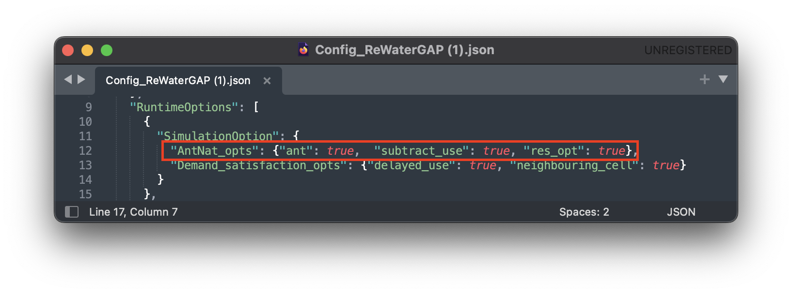
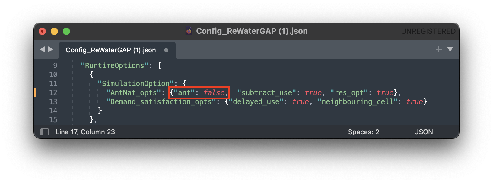
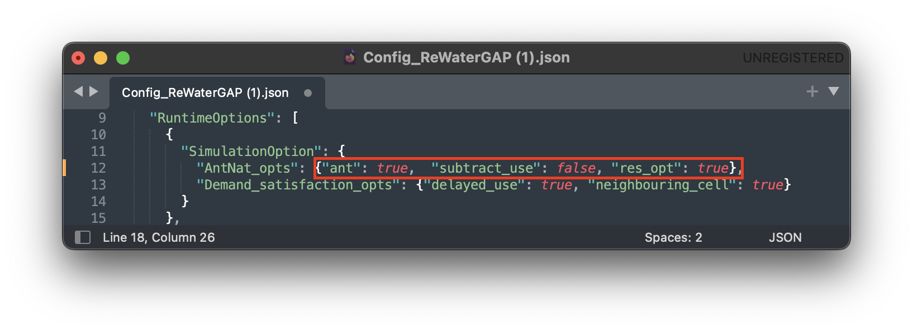
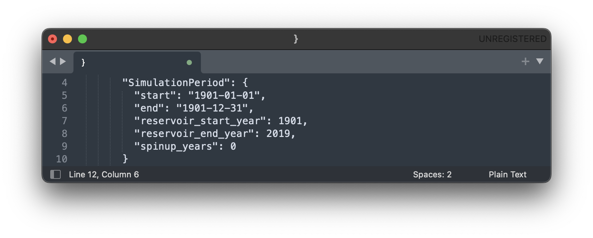
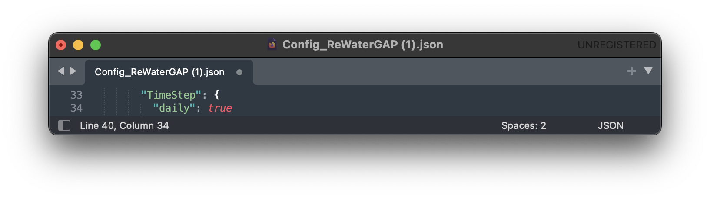
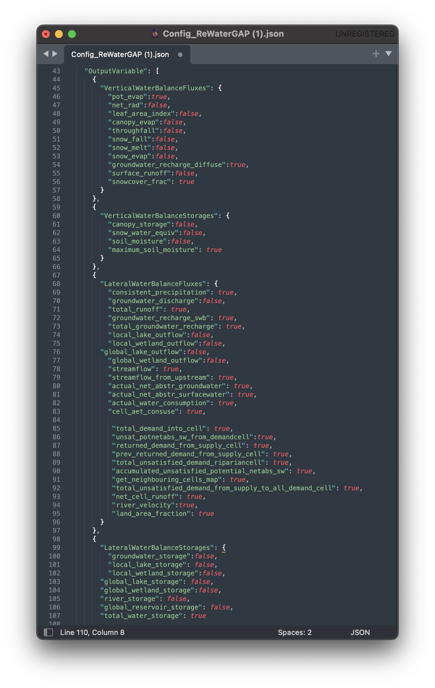

.. _configuration_file:

==================
Configuration File
==================

.. contents:: 
   :depth: 4
   :start: 2
  
Component of the configuration file
************************************

File Path
#########

Users can change the path to the climate forcings, water use data and static land data required by WaterAP in NetCDF format in the "inputDir". The path to the output data can be changed in the "outputDir".

.. figure:: ../images/user_guide/file_path.png

.. note::
	The climate forcing directory should follow the folder structure as described in the :ref:`five minute guide <get_input_data>`.

Runtime Options
###############

Simulation Options
++++++++++++++++++

"AntNat_opts": {"ant": true,  "subtract_use": true, "res_opt": true} as shown in the [link above image] image, simulates the effects of both human water use and man-made reservoirs (including their commissioning years) on flows and storages and is referred to as a standard anthropogenic run.

The following options in „AntNat_opts“ can be turned off and on to simulate:

(a) a naturalized run (without human impact). For a tutorial on how naturalized runs work, see :ref:`here <naturalized_run>`.

(b) human water use only (simulation excludes reservoir impact). For a tutorial on how naturalized runs work, see :ref:`here <human_water_use_only>`.

.. figure:: ../images/user_guide/use_only_run.png

(c) reservoirs only (simulation excludes human water use). For a tutorial on how naturalized runs work, see :ref:`here <reservoirs_only>`.

WaterGap satisfies surface water demand spatially using three options:
	- riparian water supply option which by default is always enabled and can not be disabled.
	- neighboring cell water supply option 
	- delayed water supply option

The neighboring cell and delayed use water supply option can either or both be activated (set to "true") or deactivated (set to "false") in the "Demand_satisfaction_opts" as shown in the picture below:
 
picture Demand_satisfaction_opts.png

For more details on these water satisfaction options read :ref: net abstractions. 

Restart Options
+++++++++++++++

.. figure:: ../images/user_guide/restart_options.png

Setting "restart" to "true" will prompt WaterGAP to restart from a previously saved state.
To create a saved state, the "save_model_states_for_restart" option must be set to "true".
The directory to save saved states (storages, fluxes, etc.) can be defined in the "save_and_read_states_dir" option.

For a tutorial on how to restart WaterGAP from a saved state, see here [tutorial].

SimulationPeriod
++++++++++++++++

Users can change the start and end dates of the simulation, the start and end operational years for reservoirs, as well as model spinup years.

Time Step
+++++++++
                                    

At the moment WaterGAP simulations only use daily temporal resolution. Always leave it set to "true".

SimulationExtent
++++++++++++++++

Setting the "run_basin" to "true" will prompt WaterGAP to run for a particular basin. You can define the downstream grid cell using the "path_to_stations_file". An example file (stations.csv) can be found in the static_input folder [link].

For a tutorial on how to run WaterGAP for a particular basin, see here [tutorial].

Output Variables
################
  

A comprehensive list of the output variables can be found in the [glossary]. Each output can be toggled on (set to "true") or off (set to "false") in the "OutputVariable" options.
