.. _configuration_file:

###################
Configuration Files
###################

.. contents:: 
    :depth: 3
    :backlinks: entry

**********************
Configuration File WHM
**********************

File Path
#########

Users can change the path to the climate forcings, water use data and static land data required by WaterAP in NetCDF format in the "inputDir" (see :ref:`image <file_path>` below). The path to the output data can be changed in the "outputDir".

.. _file_path: 

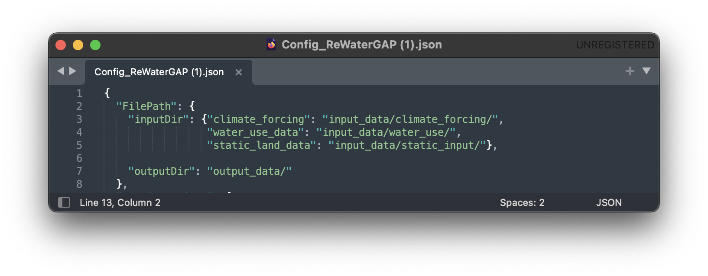

.. note::
	The climate forcing directory should follow the folder structure as described in the :ref:`five minute guide <get_input_data>`.

Runtime Options
###############

Simulation Options
******************

.. _standard_run:

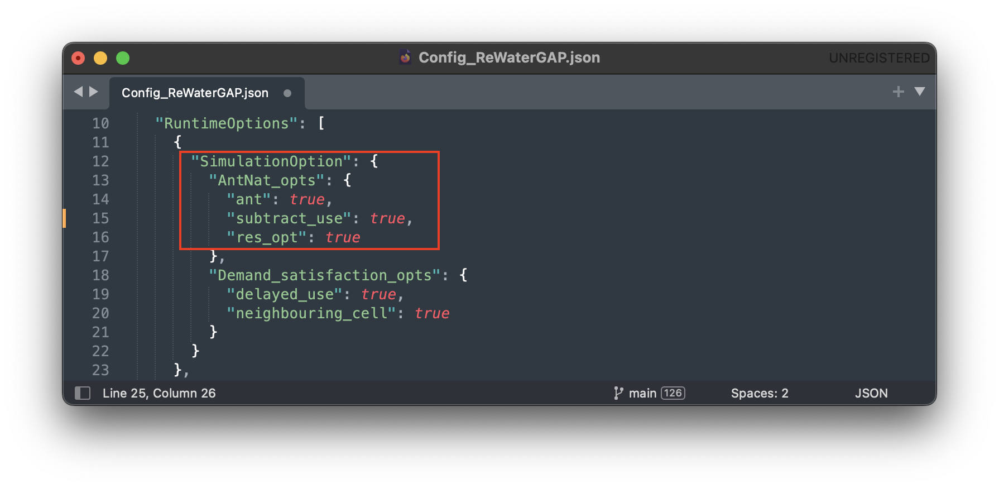

"AntNat_opts": {"ant": true, "subtract_use": true, "res_opt": true} as shown in the :ref:`image <file_pathk>` above, simulates the effects of both human water use and man-made reservoirs (including their commissioning years) on flows and storages and is referred to as a standard anthropogenic run.

Reservoir release algorithm
~~~~~~~~~~~~~~~~~~~~~~~~~~~

Inside ``RuntimeOptions[0].SimulationOption``, configure:

.. code-block:: json

    "ReservoirOperation": {
      "res_operation_algorithm": "scaling",
      "reservoir_forcing": "era5",
      "reservoir_routing_data_path": "input_data/static_input/reservoir_regulated_lake"
    }

Choose ``scaling`` for the six seasonal reservoir parameters, or ``hanasaki``
for the Hanasaki release rule. ``AntNat_opts.res_opt`` must be enabled.
Scaling keeps the existing reservoir inputs. Hanasaki reads inflow, demand,
and start months from ``reservoir_routing_era5`` or ``reservoir_routing_w5e5``
under the specified path, retaining local reservoir geometry. The forcing is
explicit and does not depend on the parameter filename.

The following options in „AntNat_opts“ can be turned off and on to simulate:

(1) a naturalized run (without human impact). For a tutorial on how to simulate a naturalized run, see :ref:`here <naturalized_run>`.

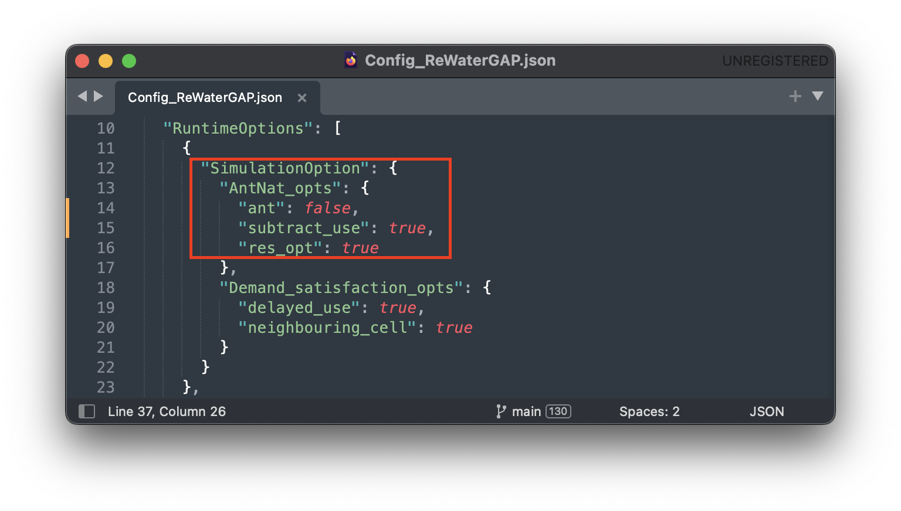

(2) human water use only (simulation excludes reservoir impact). For a tutorial on how to run WaterGAP simulation with human water use only, see :ref:`here <human_water_use_only>`.

(3) reservoirs only (simulation excludes human water use). For a tutorial on how to run WaterGAP simulation with reservoirs only, see :ref:`here <reservoirs_only>`.

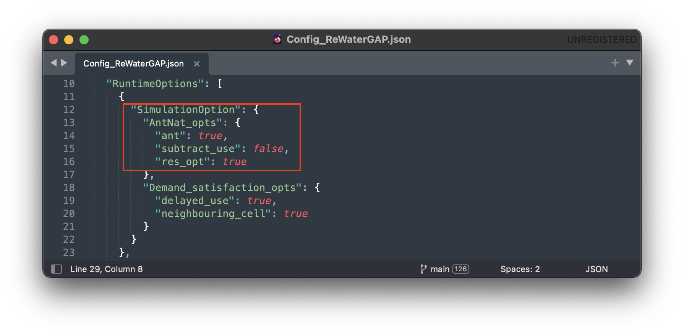

WaterGap satisfies surface water demand spatially  using:  
	- riparian water supply option which by default is always enabled and can not be disabled.
	- neighboring cell water supply option 
and temporally using :
	- delayed water supply option

The neighboring cell and delayed use water supply option can either or both be activated (set to "true") or deactivated (set to "false") in the "Demand_satisfaction_opts" as shown in the  :ref:`image <demand_sat_image>` below:

.. _demand_sat_image:

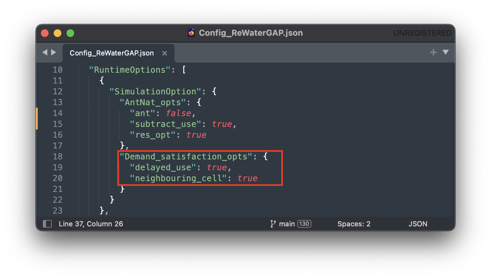

For more details on these water satisfaction options read :ref:`net abstractions <net_abstractions>`. 

Restart Options
***************

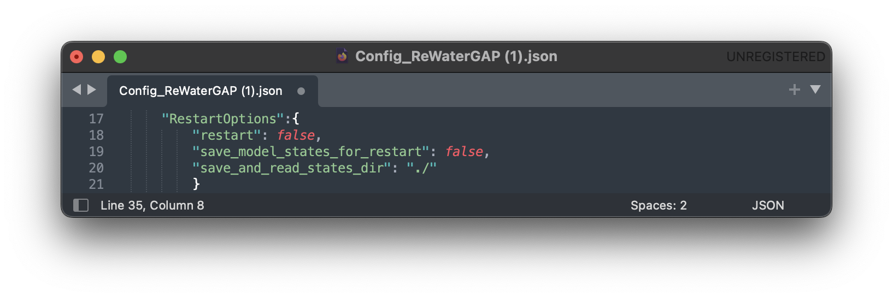

Setting "restart" to "true" will prompt WaterGAP to restart from a previously saved state.
To create a saved state, the "save_model_states_for_restart" option must be set to "true".
The directory to save saved states (storages, fluxes, etc.) can be defined in the "save_and_read_states_dir" option.

For a tutorial on how to restart WaterGAP from a saved state, see :ref:`here <restart_from_saved_state>`.

Simulation Period
******************

Users can change the start and end dates of the simulation, the start and end operational years for reservoirs, as well as model spinup years (see :ref:`image <simulation_period>` below).

.. _simulation_period:

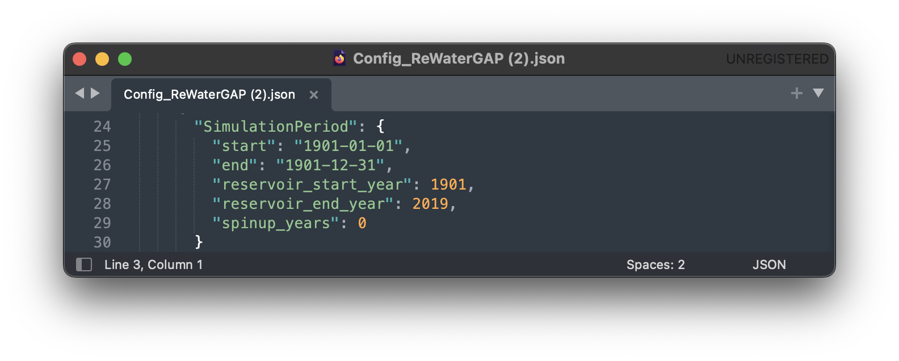

Time Step
*********
                                    
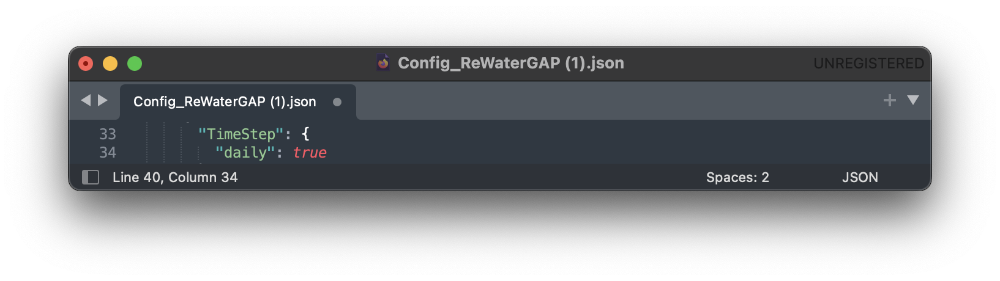

At the moment WaterGAP simulations only use daily temporal resolution. Always leave it set to "true".

Simulation Extent
*****************

.. _sim_extent: 

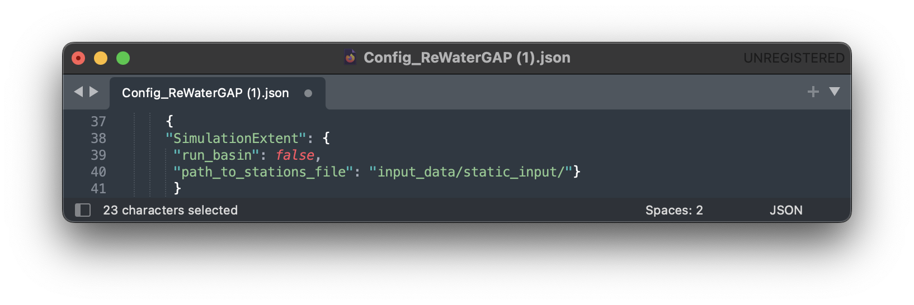

Setting the "run_basin" to "true" will prompt WaterGAP to run for a particular basin. By chosing a downstream grid cell, WaterGAP defines a corresponding upstream basin.  To define the downstream grid cell the location of the grid cell (in degree latitude and longitude) defined in a station.csv file.  The path to such file is passsed to WaterGAP using the "path_to_stations_file" (see :ref:`image <sim_extent>`). An example file (stations.csv) can be found in the static_input folder [https://github.com/HydrologyFrankfurt/ReWaterGAP/blob/main/input_data/static_input/stations.csv].

For a tutorial on how to run WaterGAP for a particular basin, see :ref:`here <stations>`.

Output Variables
################

.. _out_var: 

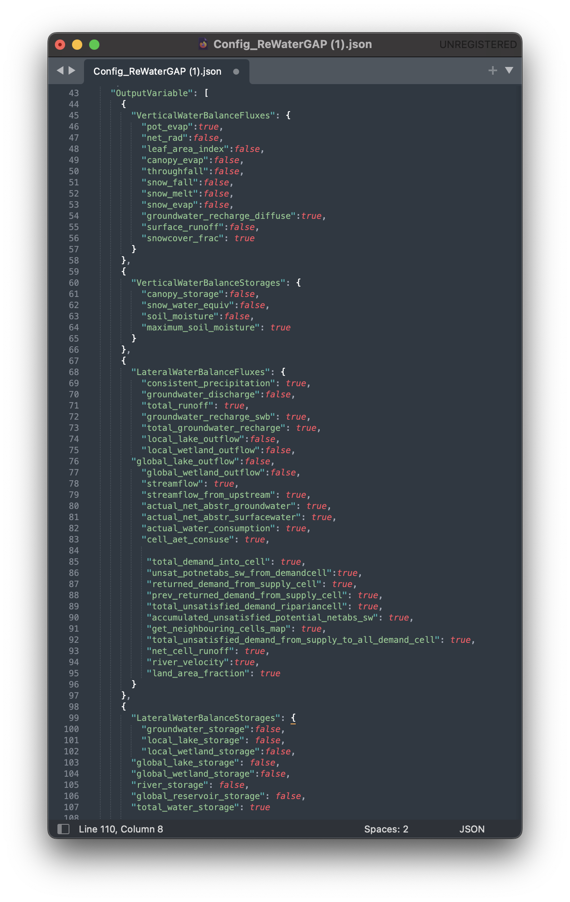

A comprehensive list of the output variables in the :ref:`image <out_var>` above can be found in the :ref:`glossary <glossary>`. Each output can be toggled on (set to "true") or off (set to "false") in the "OutputVariable" options.

Daily and monthly selection
***************************

``OutputVariable`` contains independent ``Daily`` and ``Monthly`` lists. Each
list contains the same four groups and variable flags as before. Set a variable
to ``true`` in either list, both lists, or neither. Missing flags are disabled.
For example, this writes daily discharge and monthly recharge and total storage:

.. code-block:: json

    "OutputVariable": {
      "Daily": [
        {"LateralWaterBalanceFluxes": {"streamflow": true}}
      ],
      "Monthly": [
        {"VerticalWaterBalanceFluxes": {"groundwater_recharge_diffuse": true}},
        {"LateralWaterBalanceStorages": {"total_water_storage": true}}
      ]
    }

Daily and monthly output flags can be set independently. Legacy configurations
where ``OutputVariable`` is a list still select daily outputs. The model time step remains daily.
Monthly values are accumulated during simulation; monthly-only variables do
not allocate or write daily output arrays. Files are saved at year end or the
last simulation day, using the existing naming pattern:

* Daily: ``dis_2010-12-31.nc`` (daily values for that simulation year).
* Monthly: ``dis_2010-12.nc`` (monthly values for that simulation year).
* A run ending on 2010-02-02 produces ``dis_2010-02-02.nc`` and/or
  ``dis_2010-02.nc``. The latter contains January and the simulated part of February.

Monthly aggregation and units
*****************************

* Water amounts (precipitation, evaporation, snowmelt, recharge, runoff,
  lake/wetland outflows, abstraction, consumption and demand diagnostics) are
  **summed**. Daily files use ``kg m-2 s-1``; monthly files use ``kg m-2``
  (equivalent to mm accumulated over the month). When checking against daily
  files, multiply the sum of daily rates by 86400 seconds.
* River discharge, upstream discharge, and reservoir inflow/outflow are
  **averaged**, retaining ``m3 s-1``.
* Water storages are **averaged**, retaining ``kg m-2``. Leaf area index,
  land/snow fractions, lake/wetland extents, and river velocity are also
  **averaged** in their existing units.
* Net radiation is **averaged** in ``W m-2``. Its previous water-flux label
  and conversion were incorrect; daily output now also uses ``W m-2``.
  River velocity uses the corrected conversion from km/day to ``m s-1``.
* ``maximum_soil_moisture`` is static and writes ``smax.nc`` once per save,
  even when selected at both frequencies.
* ``get_neighbouring_cells_map`` contains cell indices, so monthly output
  retains the **last simulated day's map**, rather than averaging indices.

Monthly time coordinates use the first day of each month. ``time_bnds`` gives
the actual simulated interval, including partial months. Every year has 365 days; February always has 28
days and February 29 is excluded. Monthly files declare the ``noleap`` calendar.
``cell_methods`` and ``aggregation`` describe each variable's aggregation.
Missing daily values propagate to missing monthly values; an all-missing cell
is never converted to a zero total. Partial-month means use only simulated days,
and totals cover only those days. Separate restarted runs do not automatically
merge their partial-month files.

Calibration retains its required daily discharge and potential-runoff buffers
internally, regardless of monthly selections.

.. _configuration_file_gwswuse:

**************************
Configuration File GWSWUSE
**************************

File Path
#########

.. _file_path_gwswuse: 

- `input_data`: Path to the folder containing input data. This folder must have a specific structure for the data to be correctly matched and processed.
- `gwswuse_convention`: Path to the convention file that defines the conventions for data verification and processing.
- `outputDir`: Path to the folder where output data will be stored.

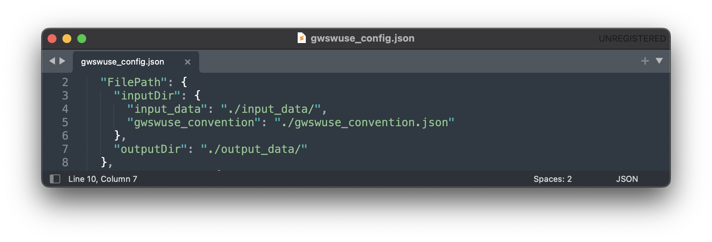

Runtime Options
###############

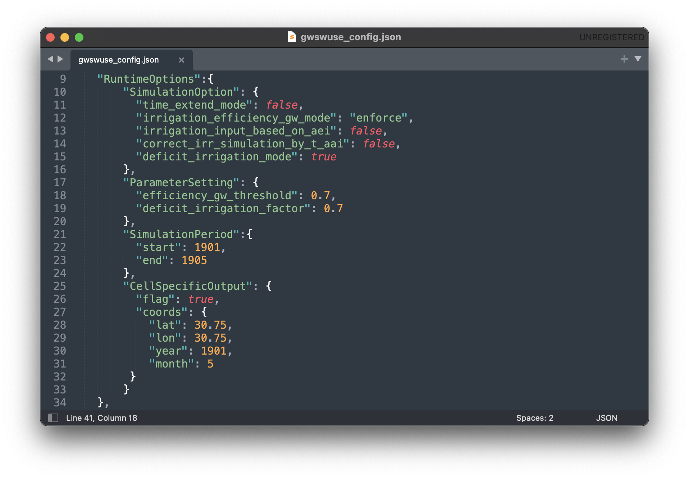

Simulation Options
******************

- `time_extend_mode`: Controls how time-dependent input data is handled to ensure they cover the entire simulation period.
- `irrigation_efficiency_gw_mode`: Determines how irrigation efficiency with groundwater is calculated.
- `irrigation_input_based_on_aei`: Specifies how input data for irrigation-specific consumptive water use is interpreted.
- `correct_irr_simulation_by_t_aai`: Indicates whether the simulation should adjust for temporal changes in irrigated areas.
- `deficit_irrigation_mode`: Determines whether the simulation considers deficit irrigation in certain grid cells.

Parameter Setting
*****************

- `efficiency_gw_threshold`: Threshold for irrigation efficiency with groundwater.
- `deficit_irrigation_factor`: Reduction factor for irrigation in grid cells identified as deficient.

Simulation Period
*****************

CellSpecific Output
*******************

- `flag`: If true, sector-specific intermediate results for the grid cell closest to the coordinates in `CellSpecificOutput["coords"]` will be displayed in the CLI during the simulation.
- `coords`: A sub-dict for setting coordinates for the grid cell and timestep for displaying cell-specific results in the CLI:
- `Lat`: Latitude of the grid cell
- `Lon`: Longitude of the grid cell
- `Year`: Year
- `Month`: Month (for irrigation and total)

Output Variables
################

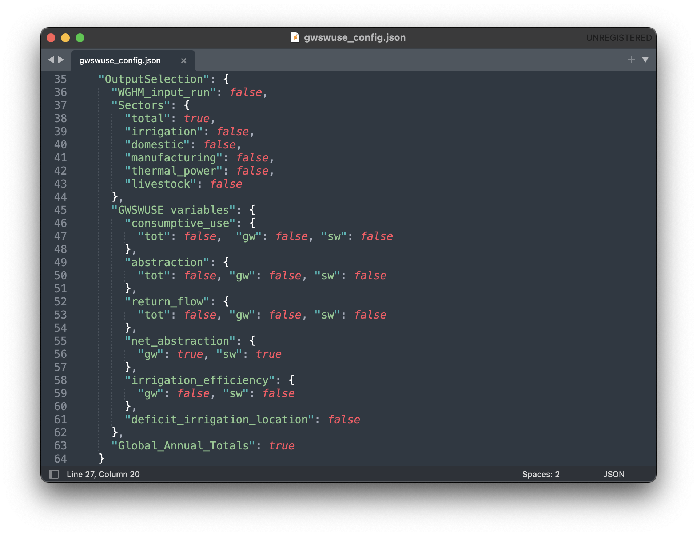

Determines which simulation results are saved and in what format they are output.

- `WGHM_input_run`: Controls whether the results are retained in memory for further use in a ReWGHM run.
- `Sectors`: Selection of sectors for which simulation results should be saved (e.g., irrigation, households, etc.).
- `GWSWUSE variables`: Defines which specific variables (e.g., `consumptive_use`, `abstraction`, `return_flow`, `net_abstraction`) for each water source (groundwater or surface water) should be saved.
- `Global_Annual_Totals`: Controls whether ReGWSWUSE generates a comprehensive overview of simulation results in an Excel file with global annual values.
