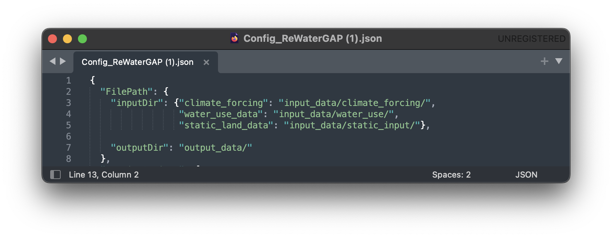
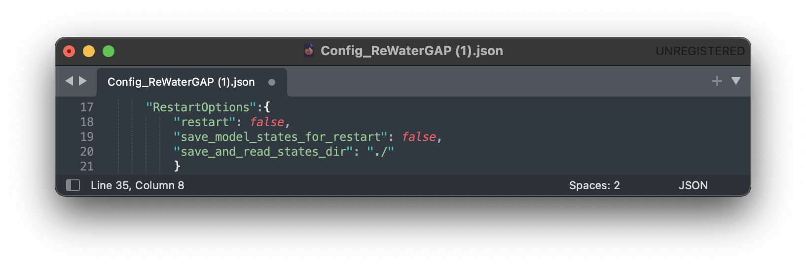
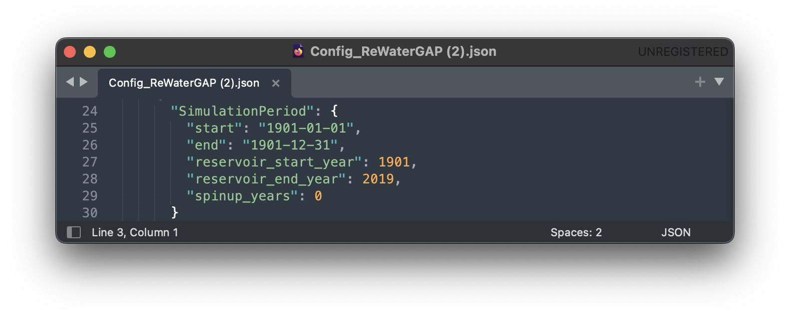

.. _configuration_file:

##################
Configuration File
##################

.. contents:: 
    :depth: 3
    :backlinks: entry

************************************
Component of the configuration file
************************************

File Path
#########

Users can change the path to the climate forcings, water use data and static land data required by WaterAP in NetCDF format in the "inputDir" (see :ref:`image <file_path>` below). The path to the output data can be changed in the "outputDir".

.. _file_path: 

.. note::
	The climate forcing directory should follow the folder structure as described in the :ref:`five minute guide <get_input_data>`.

Runtime Options
###############

Simulation Options
******************

.. _standard_run:

.. figure:: ../images/user_guide/configuration_file/simulation_options_standard.png

"AntNat_opts": {"ant": true, "subtract_use": true, "res_opt": true} as shown in the :ref:`image <file_pathk>` above, simulates the effects of both human water use and man-made reservoirs (including their commissioning years) on flows and storages and is referred to as a standard anthropogenic run.

The following options in „AntNat_opts“ can be turned off and on to simulate:

(1) a naturalized run (without human impact). For a tutorial on how to simulate a naturalized run, see :ref:`here <naturalized_run>`.

.. figure:: ../images/user_guide/configuration_file/simulation_options_naturalized_run.png

(2) human water use only (simulation excludes reservoir impact). For a tutorial on how to run WaterGAP simulation with human water use only, see :ref:`here <human_water_use_only>`.

.. figure:: ../images/user_guide/configuration_file/simulation_options_use_only_run.png

(3) reservoirs only (simulation excludes human water use). For a tutorial on how to run WaterGAP simulation with reservoirs only, see :ref:`here <reservoirs_only>`.

.. figure:: ../images/user_guide/configuration_file/simulation_options_reservoirs_only_run.png

WaterGap satisfies surface water demand spatially  using:  
	- riparian water supply option which by default is always enabled and can not be disabled.
	- neighboring cell water supply option 
and temporally using :
	- delayed water supply option

The neighboring cell and delayed use water supply option can either or both be activated (set to "true") or deactivated (set to "false") in the "Demand_satisfaction_opts" as shown in the  :ref:`image <demand_sat_image>` below:

.. _demand_sat_image:

.. figure:: ../images/user_guide/configuration_file/simulation_options_demand_satisfaction_opts.png

For more details on these water satisfaction options read :ref:`net abstractions <net_abstractions>`. 

Restart Options
***************

Setting "restart" to "true" will prompt WaterGAP to restart from a previously saved state.
To create a saved state, the "save_model_states_for_restart" option must be set to "true".
The directory to save saved states (storages, fluxes, etc.) can be defined in the "save_and_read_states_dir" option.

For a tutorial on how to restart WaterGAP from a saved state, see :ref:`here <restart_from_saved_state>`.

Simulation Period
******************

Users can change the start and end dates of the simulation, the start and end operational years for reservoirs, as well as model spinup years (see :ref:`image <simulation_period>` below).

.. _simulation_period:

Time Step
*********
                                    
.. figure:: ../images/user_guide/configuration_file/time_step.png

At the moment WaterGAP simulations only use daily temporal resolution. Always leave it set to "true".

Simulation Extent
*****************

.. _sim_extent: 

Setting the "run_basin" to "true" will prompt WaterGAP to run for a particular basin. By chosing a downstream grid cell, WaterGAP defines a corresponding upstream basin.  To define the downstream grid cell the location of the grid cell (in degree latitude and longitude) defined in a station.csv file.  The path to such file is passsed to WaterGAP using the "path_to_stations_file" (see :ref:`image <sim_extent>`). An example file (stations.csv) can be found in the static_input folder [https://github.com/HydrologyFrankfurt/ReWaterGAP/blob/main/input_data/static_input/stations.csv].

For a tutorial on how to run WaterGAP for a particular basin, see :ref:`here <stations>`.

Output Variables
################

.. _out_var: 

A comprehensive list of the output variables in the :ref:`image <out_var>` above can be found in the :ref:`glossary <glossary>`. Each output can be toggled on (set to "true") or off (set to "false") in the "OutputVariable" options.
