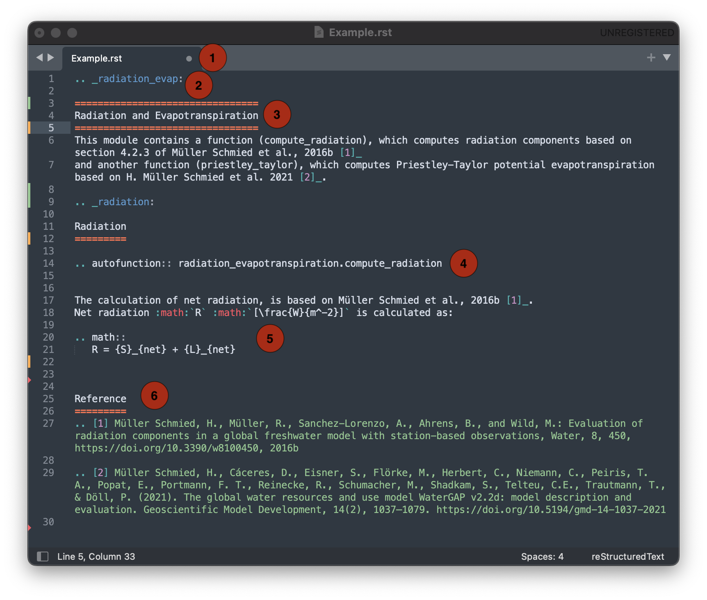

.. _tutorials:

########
Tutorial
########

.. contents:: 
    :depth: 4

Running WaterGAP
================

Standard WaterGap calibration
-----------------------------

Running the simulation for a global basin
-----------------------------------------

Running with different options (use/no use, reservoir yes/no, period)

Running the simulation for a particular basin
---------------------------------------------

Standard anthropogenic run
**************************

human use of reservoir

How to Restart WaterGap
-----------------------

(save file and continue simulation)
Standard anthropogenic run for restart run (month and year)

Running WaterGAP with GWSWUSE
-----------------------------

Contributing to WaterGAP
========================

How to create an API page
*************************

The ReWater Gap documentation consists of a number of rst files referencing each other and being compiled into a readable website by Sphinx [reference]. To ensure the function of the documentation, individual docs follow a styling guide described hereafter. For an example API page: :ref:`click here <river>`

**1. Creating a new page**

Any API doc has the file type .rst and as such uses reStructured Text syntax to render. 

**2. Create a unique name for the doc with which it can be called from any other doc**

After creating a new page, give it a name that allows other pages to link to the newly created one from anywhere. To do this, add the following syntax to the first line of the document::

.. name:: (e.g. .. snow_storage:: for a document on snow storage)

**3. Creating a header**

The page needs a name which can be identified quickly out of a table of contents and found easily using the search function of the documentation. We use names such as "Snow" or "River" for API Docs relating to the storage of Snow and Rivers respectively. Also give a short description of what the doc is about, that helps a user determine if they found what they were looking for.

**4. Link the function which is being described**

Calling a function into the documentation to give users an overview of parameters can be accomplished using the "autofunction" function::

.. autofunction:: snow.subgrid_snow_balance

**5. Describe any relevant formulas and calculations**

For this a number of styling options are available. A detailed list can be found on the pydata sphinx theme `here <https://pydata-sphinx-theme.readthedocs.io/en/stable/index.html>`_. A guide on rst syntax can be found `here <https://bashtage.github.io/sphinx-material/rst-cheatsheet/rst-cheatsheet.html>`_ .

**6. Credit your sources**

To create a reference list create a new section of the document beginning with::

    References
    ==========

To create a new reference use::

.. [1] your reference goes here

To call the reference from any point within the same document use the syntax::

[1]_

Add GWSWUSE API to API
----------------------

