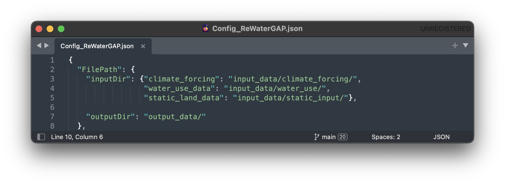
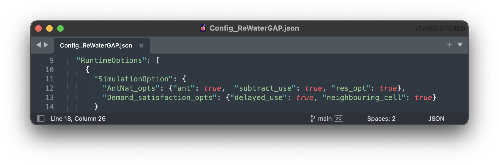
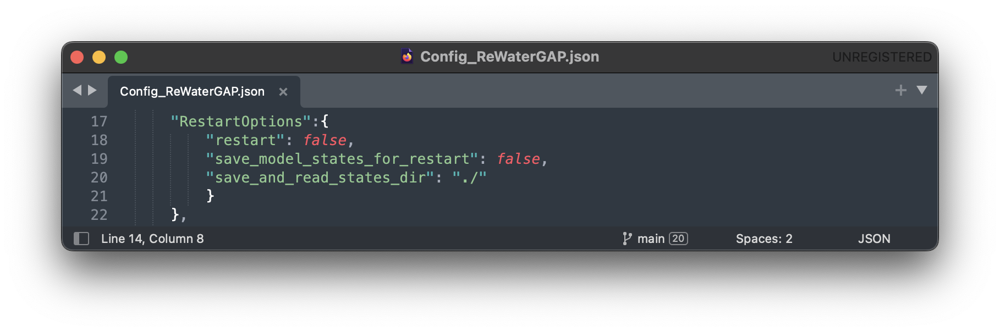
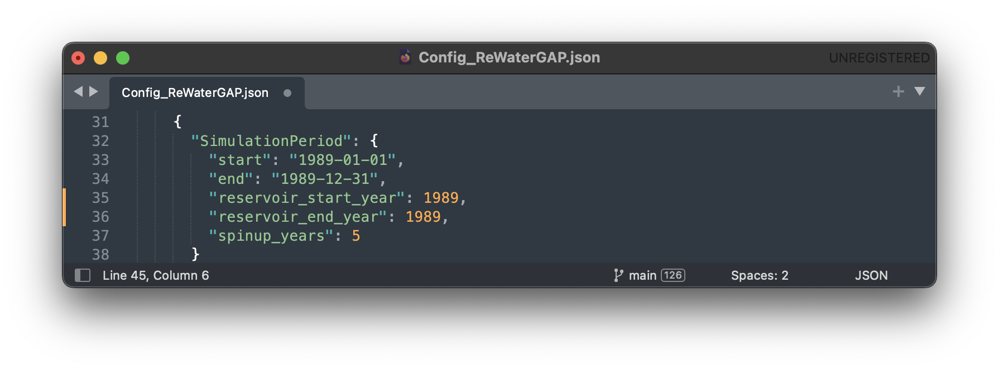
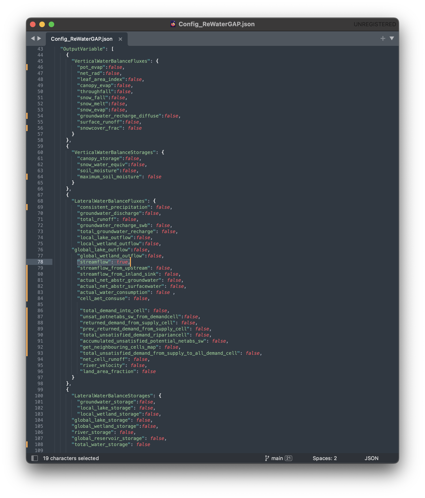
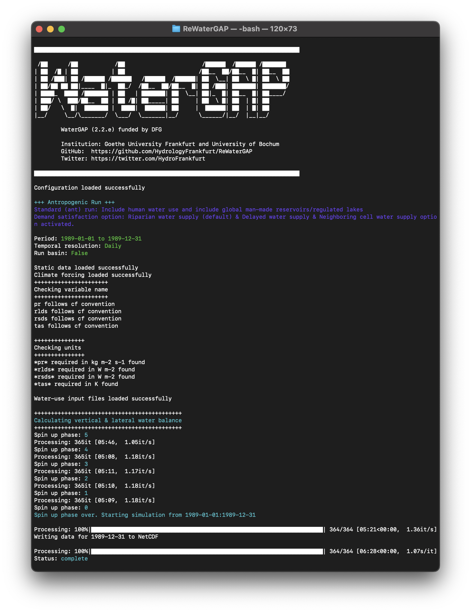
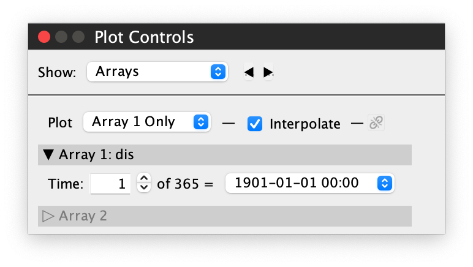
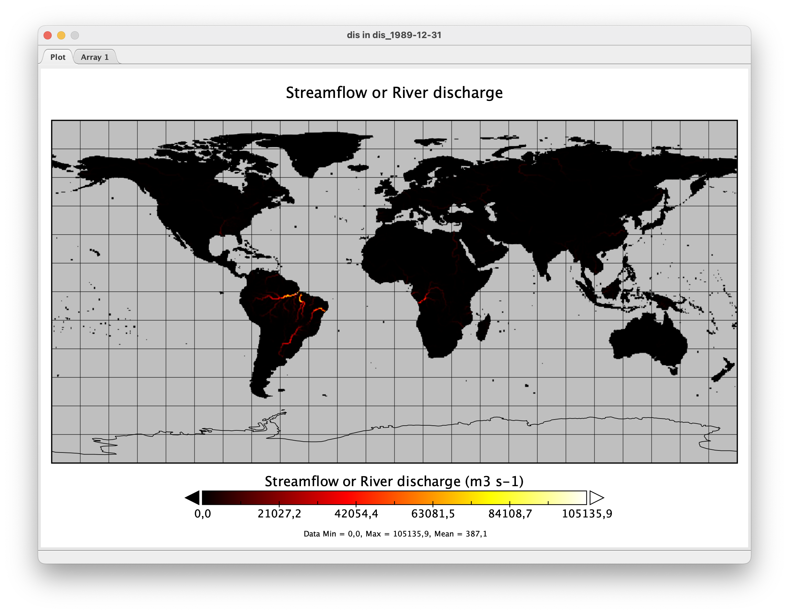

.. _tutorials:

############################
Tutorial (Under Development)
############################

.. contents:: 
    :depth: 4

.. note::
	Before following this tutorial, please follow the five minute guide found :ref:`here <five_minute_guide>`.

Running Water Gap with different simulation options (other model configurations)
================================================================================

Naturalized Run
***************

This simulation computes naturalized flows and storages that would occur if there were neither human water use nor global man-made reservoirs/regulated lakes.

To run Water Gap in a naturalized mode, see :ref:`here <naturalized_run>`.

Standard anthropogenic Run
**************************

The standard run in WaterGAP simulates the effects of both human water use and man-made reservoirs (including their commissioning years) on flows and storages.

In the example below, we will create a standard run for one year (1989) and go through the necessary steps step-by-step.

**Prerequisites:** You will need to clone WaterGAP and create an environment to run it in. If you haven't done so already follow the :ref:`five minute guide <five_minute_guide>` for this.

.. _prepare_input_data:

**1) Download the climate forcing data of your choice.**

In this example, we will be using the forcing "gswp3-w5e5_obsclim" from `ISIMIP <https://data.isimip.org/search/tree/ISIMIP3a/InputData/climate/atmosphere/gswp3-w5e5/obsclim/query//>`_ . The forcings from ISIMIP are sorted in groups of 10 years. We will be using the group of 1981 to 1990 as our example year of 1989 is in this group.
The forcings required are:

- precipitation [kg m-2 s-1]; `Link in ISIMIP <https://files.isimip.org/ISIMIP3a/InputData/climate/atmosphere/obsclim/global/daily/historical/GSWP3-W5E5/gswp3-w5e5_obsclim_pr_global_daily_1981_1990.nc>`_ 
- downward longwave radiation [Wm-2]; `Link in ISIMIP <https://files.isimip.org/ISIMIP3a/InputData/climate/atmosphere/obsclim/global/daily/historical/GSWP3-W5E5/gswp3-w5e5_obsclim_rlds_global_daily_1981_1990.nc>`_ 
- downward shortwave radiation [Wm-2]; `Link in ISIMIP <https://files.isimip.org/ISIMIP3a/InputData/climate/atmosphere/obsclim/global/daily/historical/GSWP3-W5E5/gswp3-w5e5_obsclim_rsds_global_daily_1981_1990.nc>`_ 
- temperature [K]; `Link in ISIMIP <https://files.isimip.org/ISIMIP3a/InputData/climate/atmosphere/obsclim/global/daily/historical/GSWP3-W5E5/gswp3-w5e5_obsclim_tas_global_daily_1981_1990.nc>`_ 

*Make sure to remove the leap days (29th February) from the climate forcings if you are running the simulation for a leap year (WaterGap does not consider leap days)* 

**2) Download the water use data.**

The forcings required are:

- potential consumptive use from irrigation using surface water :math:`[m3/month]`
- potential water withdrawal use from irrigation using surface water :math:`[m3/month]`
- potential net abstractions from surface water :math:`[m3/month]`
- potential net abstractions from groundwater :math:`[m3/month]`

Due to licensing, a download link will be made available at a later date. If you require the data, you may request a download link by sending us an `Email <mailto:Nyenah@em.uni-frankfurt.de>`_ .

**3) Place the downloaded data into their correct folders in the repository.**

In your WaterGAP repository, navigate to "input_data" and place the downloaded files for climate forcings and water use in their correct folders as seen in the picture below.

.. figure:: ../images/getting_started/input_data.png

.. _modify_the_configuration_file_tutorial:

**4) Modify the configuration file to set up a standard run.**

In your WaterGAP repository, navigate to "Config_ReWaterGAP.json". 

**4.1) File Paths**

The first options in the configuration file regard input and output file paths. In this example, we will leave them unmodified.

**4.2) Runtime Options**

In the configuration file find the runtime options. Then find the simulation options. Set all options under "AntNat_opts" to "true". Set all options under "Demand_satisfaction_opts" to "true". 

**4.3) Restart Options**

In this run, WaterGap will not restart from a previous state. Under "restart_options" make sure each option is set to "false".

**4.4) Simulation Period Options**

Next up the chosen timeframe for the simulation needs to be set. Under "SimulationPeriod" change the "start" date to "1989-01-01" and the "end" date to "1989-12-31".
For the reservoir operational years set the start and end years to "1989". We will be using a five year spin-up period in this example. Change "spinup_years"
	

**4.5) Time step**

Under "time_step" leave the resolution set to "daily"

**4.6) Simulation Extend**

We will not be running WaterGAP for a basin in this example so leave the "run_basin" option under "SimulationExtent" set to "false".

**4.7) Output Variables**

Any number of variables may be written out. In this example, we will only want to write out the "streamflow" variable. Under "LateralWaterBalanceFluxes" find "streamflow" and set it to "true". Everything else should be set to "false". For a detailed explanation on which variables can be written out see the :ref:`glossary <glossary>`.

**4.8) Save the configuration file**

**5) Run the simulation**

To run WaterGAP, use the following command in your terminal:

.. code-block:: bash

	$ python3 run_watergap.py Config_ReWaterGAP.json

In case of a problem find help in the `five minute guide <five_minute_guide>`_ .

If your run has been successful, your Terminal should look like this:

In your WaterGAP repository under "output_data" you will find a file named "dis_1989-12-31.nc". 

.. _visualize_using_panopoly:

**6) Visualizing your results using Panopoly**

To visualize the output of this standard run we suggest using `Panopoly <https://www.giss.nasa.gov/tools/panoply/>`__. Download and install it. Then click on "file" -> "open". Navigate to your ReWaterGAP folder. Then to "output_data" and select the created file "dis_1989-12-31.nc". Click on "open".

You should now see your data set. Double-click the "dis" file in "Geo2D" format and click create.

Once you see a world map, labeled "Streamflow or River discharge" go to "Window" -> "Plot Controls" where you will see the time set to "1" of "365". By increasing the time you will see the River discharge change visually on the map. We recommend changing the color scheme to "GMT_hot.cpt" under "Window" -> "Color Tables Browser".

.. _human_water_use_only:

Human Water Use only 
********************

This simulation includes human water use but excludes global man-made reservoirs/regulated lakes. When creating a human-water-use-only run, the setup follows the standard run in all but one steps. In the example below, we will create a human-water-use-only run for one year (1989) and go through the necessary steps step-by-step.

**Prerequisites:** You will need to clone WaterGAP and create an environment to run it in. If you haven't done so already follow the :ref:`five minute guide <five_minute_guide>` for this.

**1) Prepare the input data.**

Download all required climate forcing and water use data, remove all leap days and place the data in the input_data fodler in your ReWaterGAP repository as explained :ref:`above <prepare_input_data>`.

**2) Modify the configuration file to set up a human-water-use-only run.**

The only difference between a standard and a human-water-use-only run are the simulation options. In your configuration file, under "SimulationOption" find “AntNat_opts”. Set "ant" to "true," "subtract_use" to "true" and "res_opt" to "false" as seen in the picture :ref:`below <use_only_run_example_picture>`.

.. _use_only_run_example_picture:

.. figure:: ../images/user_guide/use_only_run.png

Set up File Paths, other Runtime Options, Restart Options, Simulation Period Options, Time step, Simulation Extend and Output Variables as described :ref:`above <modify_the_configuration_file_tutorial>` and save it.

**3) Run the simulation**

To run WaterGAP, use the following command in your terminal:

.. code-block:: bash

	$ python3 run_watergap.py Config_ReWaterGAP.json

In case of a problem find help in the `five minute guide <five_minute_guide>`_ .

In your WaterGAP repository under "output_data" you will find a file named "dis_1989-12-31.nc". 

**4) Visualizing your results using Panopoly**

For a brief guide on using Panopoly for data visualization see `above <visualize_using_panopoly>`_.

.. _reservoirs_only:

Reservoirs only
***************

This simulation excludes human water use but includes global man-made reservoirs/regulated lakes.

.. _restart_from_saved_state:

How to Restart WaterGap from saved state
========================================

Running WaterGAP with GWSWUSE (under development)
=================================================

