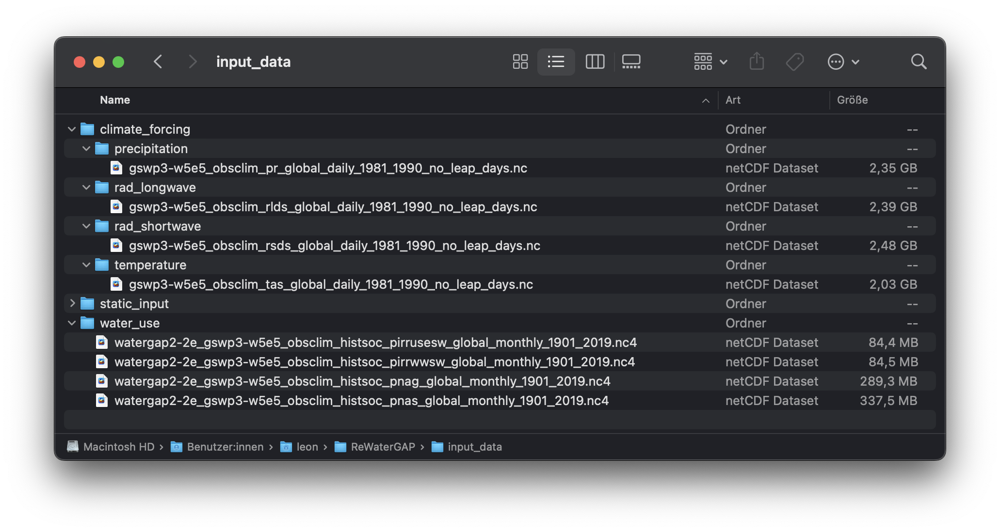
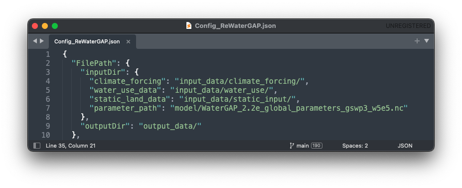
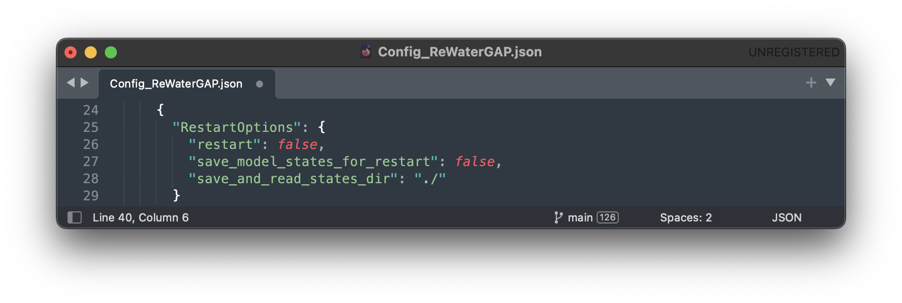
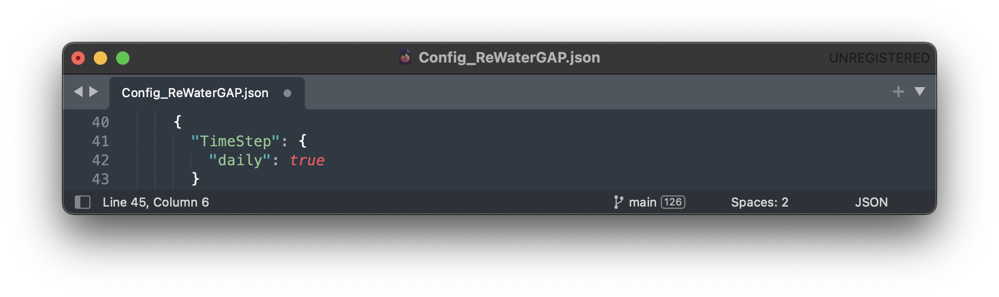
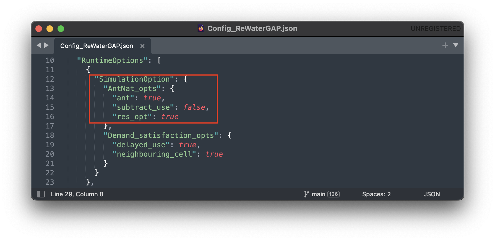

.. _tutorials:

############################
Tutorial (Under Development)
############################

.. contents:: 
    :depth: 3
    :backlinks: entry

.. note::
	Before following this tutorial, please follow the five minute guide found :ref:`here <five_minute_guide>`.

.. _prepare_input_data:

********************
Preparing Input Data
********************

In your WaterGap repository you will find an **input_data** folder, which will hold all relevant climate forcings, water use data as well as static data needed to run the simulation. Throughout this tutorial we will be running the simulation for the year 1989.

Goethe University Frankfurt Data Repository
##############################################

A comprehensive list of available data from the Goethe University Frankfurt can be found here:

- `Climate forcing GSWP3-ERA5 <https://doi.org/10.25716/GUDE.0H3E-SBWV>`_ [1]_
- `Water use input and 20CRv3-ERA5 climate forcing <https://doi.org/10.25716/GUDE.1BGX-87AA>`_ [2]_
- `Water use input and 20CRv3-W5E5 climate forcing <https://doi.org/10.25716/GUDE.0H6A-SR8Q>`_ [3]_
- `Water use input and GSWP3-ERA5 climate forcing <https://doi.org/10.25716/GUDE.1VNN-DYCV>`_ [4]_
- `Water use input and GSWP3-W5E5 climate forcing <https://doi.org/10.25716/GUDE.0296-3FD7>`_ [5]_

Installation Guide
###################

1) Download the climate forcing data of your choice.
******************************************************

To begin running WaterGAP we must download the necessary climate forcing data. In the following examples, we will be using the forcing "gswp3-w5e5_obsclim" from `ISIMIP <https://data.isimip.org/search/tree/ISIMIP3a/InputData/climate/atmosphere/gswp3-w5e5/obsclim/query//>`_ . 

The forcings from ISIMIP are sorted in groups of 10 years. We will be using the group of 1981 to 1990 as our example year of 1989 is in this group.
The forcings required are:

- precipitation [kg m-2 s-1]; `Link in ISIMIP <https://files.isimip.org/ISIMIP3a/InputData/climate/atmosphere/obsclim/global/daily/historical/GSWP3-W5E5/gswp3-w5e5_obsclim_pr_global_daily_1981_1990.nc>`_ 
- downward longwave radiation [Wm-2]; `Link in ISIMIP <https://files.isimip.org/ISIMIP3a/InputData/climate/atmosphere/obsclim/global/daily/historical/GSWP3-W5E5/gswp3-w5e5_obsclim_rlds_global_daily_1981_1990.nc>`_ 
- downward shortwave radiation [Wm-2]; `Link in ISIMIP <https://files.isimip.org/ISIMIP3a/InputData/climate/atmosphere/obsclim/global/daily/historical/GSWP3-W5E5/gswp3-w5e5_obsclim_rsds_global_daily_1981_1990.nc>`_ 
- temperature [K]; `Link in ISIMIP <https://files.isimip.org/ISIMIP3a/InputData/climate/atmosphere/obsclim/global/daily/historical/GSWP3-W5E5/gswp3-w5e5_obsclim_tas_global_daily_1981_1990.nc>`_ 

.. note::
	Make sure to remove the leap days (29th February) from the climate forcings if you are running the simulation for a leap year (WaterGap does not consider leap days).

2) Download the water use data
******************************

Next up we will need to download the necessary water use data. In the following examples, we will be using the forcing "gswp3-w5e5_obsclim" from the Goethe University Frankfurt.

The forcings required are:

- potential consumptive use from irrigation using surface water :math:`[m3/month]`
- potential water withdrawal use from irrigation using surface water :math:`[m3/month]`
- potential net abstractions from surface water :math:`[m3/month]`
- potential net abstractions from groundwater :math:`[m3/month]`

In the following tutorials we will be using data provided by Müller Schmied, H. and Nyenah, E. via the Goethe University Frankfurt which can be downloaded `here <https://doi.org/10.25716/GUDE.0296-3FD7>`_. In this data leap days have already been removed.

3) Place the downloaded data into their correct folders in the repository
*************************************************************************

Once your climate forcing and water use data has finished downloading, in your WaterGAP repository, navigate to "input_data" and place the downloaded files in their correct folders as seen in the picture below:

********************************************************************************
Running Water Gap with different simulation options (other model configurations)
********************************************************************************
.. note::
	The current model uses default parameters and is not yet calibrated. Calibration is in progress, and the model parameters will be updated once this process is complete.

.. _naturalized_run:

Naturalized Run
###############

This simulation computes naturalized flows and storages that would occur if there were neither human water use nor global man-made reservoirs/regulated lakes.

To run Water Gap in a naturalized mode, find the tutorial in the :ref:`five minute guide here <naturalized_run>`.

.. _standard_anthropogenic_run:

Standard anthropogenic Run
##########################

The standard run in WaterGAP simulates the effects of both human water use and man-made reservoirs (including their commissioning years) on flows and storages.

In the example below, we will create a standard run for one year (1989) and go through the necessary steps, step-by-step.

**Prerequisites:** You will need to clone WaterGAP and create an environment to run it in. If you haven't done so already follow the :ref:`five minute guide <five_minute_guide>` for this.

.. _prepare_input_data:

1) Prepare the input data
***************************

Download all required climate forcing and water use data, remove all leap days, and place the data in the "input_data" folder in your ReWaterGAP repository as explained :ref:`above <prepare_input_data>`.

.. _modify_the_configuration_file_tutorial:

2) Set up the configuration file
*********************************

WaterGAP can be setup for your specific usecase. In the following we will be going through the various configuration options as well as the available output options and configuring the simulation for a standard anthropogenic run without restart. For a detailed description on the possible settings see our :ref:`guide to the configuration file <configuration_file>`.

To configure WaterGAP, go to your WaterGAP repository and navigate to "Config_ReWaterGAP.json" and open the configuration file. 

**2.1) File Paths**

The first options in the configuration file regard input and output file paths. In this example, we will leave them unmodified. The locations for input and output data can be seen in the picture below.

**2.2) Runtime Options**

In the configuration file find the runtime options. Then find the simulation options. Set all options under "AntNat_opts" to "true" and all options under "Demand_satisfaction_opts" to "true" to set up a standard anthropogenic run.

.. figure:: ../images/user_guide/tutorial/runtime_options_standard_run.png

**2.3) Restart Options**

In this run, WaterGap will not restart from a previous state. Under "restart_options" make sure each option is set to "false".

To find more information on restart options find a tutorial on how to save and restart WaterGAP :ref:`here <restart_from_saved_state>`.

**2.4) Simulation Period Options**

In this example we are running the simulation for the year 1989. Under "SimulationPeriod" change the "start" date to "1989-01-01" and the "end" date to "1989-12-31".
For the reservoir operational years set the start and end years to "1989". 

We will be using a five year spin-up period in this example. Set "spinup_years" to "5".

.. figure:: ../images/user_guide/tutorial/simulation_period_options_tutorial.png

**2.5) Time step**

Under "time_step" set the resolution to "daily".

**2.6) Simulation Extend**

We will not be running WaterGAP for a basin in this example so set the "run_basin" option under "SimulationExtent" to "false".

**2.7) Output Variables**

Any number of variables may be written out. In this example, we will only write out the "streamflow" variable. Under "LateralWaterBalanceFluxes" find "streamflow" and set it to "true". Everything else should be set to "false". For a detailed explanation on which variables can be written out see the :ref:`glossary <glossary>`.

.. figure:: ../images/user_guide/tutorial/output_variables_tutorial.png

**2.8) Save the configuration file**

Save the configuration file

3) Run the simulation
*********************

Navigate to your ReWaterGAP folder in the terminal, activate your environment, and run WaterGAP using the following command:

.. code-block:: bash

	$ python3 run_watergap.py Config_ReWaterGAP.json

In case of a problem find help in the :ref:`five minute guide <five_minute_guide>`.

If your run has been successful, your Terminal should look like this:

.. figure:: ../images/user_guide/tutorial/standard_run_successful_terminal.png

In your WaterGAP repository under "output_data" you will find a file named "dis_1989-12-31.nc". 

4) Visualize your results
********************************

To visualize the output of any given simulation we suggest using `Panopoly <https://www.giss.nasa.gov/tools/panoply/>`_. Find our guide to Panopoly :ref:`here <visualize_using_panopoly>`.

For the year 1989 the result should look like this:

.. figure:: ../images/user_guide/tutorial/panopoly_standard_run_tutorial.png

.. _human_water_use_only:

Human Water Use only 
####################

This simulation includes human water use but excludes global man-made reservoirs/regulated lakes. When creating a human-water-use-only run, the setup follows the standard run in all but one step. In the example below, we will create a human-water-use-only run for one year (1989) and go through the steps step-by-step.

**Prerequisites:** You will need to clone WaterGAP and create an environment to run it in. If you haven't done so, follow the :ref:`five minute guide <five_minute_guide>` for this.

1) Prepare the input data.
********************************

Download all required climate forcing and water use data, remove all leap days, and place the data in the "input_data" folder in your ReWaterGAP repository as explained :ref:`above <prepare_input_data>`.

2) Set up the configuration file
********************************

The only difference between a standard and a human-water-use-only run are the simulation options. In your configuration file, under "SimulationOption" find “AntNat_opts”. Set "ant" to "true," "subtract_use" to "true" and "res_opt" to "false" as seen in the picture :ref:`below <use_only_run_example_picture>`.

.. _use_only_run_example_picture:

.. figure:: ../images/user_guide/tutorial/runtime_options_use_only_run.png

Set up File Paths, other Runtime Options, Restart Options, Simulation Period Options, Time step, Simulation Extend and Output Variables as described :ref:`above <modify_the_configuration_file_tutorial>` and save it.

3) Run the simulation
********************************

Navigate to your ReWaterGAP folder in the terminal, activate your environment, and run WaterGAP using the following command:

.. code-block:: bash

	$ python3 run_watergap.py Config_ReWaterGAP.json

In case of a problem find help in the :ref:`five minute guide <five_minute_guide>`.

In your WaterGAP repository under "output_data" you will find a file named "dis_1989-12-31.nc".  

4) Visualize your results
********************************

To visualize the output of any given simulation we suggest using `Panopoly <https://www.giss.nasa.gov/tools/panoply/>`_. Find our guide to Panopoly :ref:`here <visualize_using_panopoly>`.

For the year 1989 the result should look like this:

.. _reservoirs_only:

Reservoirs only
###############

This simulation excludes human water use but includes global man-made reservoirs/regulated lakes. When creating a reservoirs-only run, the setup follows the standard run in all but one step. In the example below, we will create a reservoirs-only run for one year (1989) and go through the steps step-by-step.

**Prerequisites:** You will need to clone WaterGAP and create an environment to run it in. If you haven't done so, follow the :ref:`five minute guide <five_minute_guide>` for this.

1) Prepare the input data.
********************************

Download all required climate forcing and water use data, remove all leap days, and place the data in the "input_data" folder in your ReWaterGAP repository as explained :ref:`above <prepare_input_data>`.

2) Set up the configuration file
********************************

The only difference between a standard and a reservoirs-only run are the simulation options. In your configuration file, under "SimulationOption" find “AntNat_opts”. Set "ant" to "true," "subtract_use" to "false" and "res_opt" to "true" as seen in the picture :ref:`below <reservoirs_only_run_example_picture>`.

.. _reservoirs_only_run_example_picture:

Set up File Paths, other Runtime Options, Restart Options, Simulation Period Options, Time step, Simulation Extend and Output Variables as described :ref:`above <modify_the_configuration_file_tutorial>` and save it.

3) Run the simulation
********************************

Navigate to your ReWaterGAP folder in the terminal, activate your environment, and run WaterGAP using the following command:

.. code-block:: bash

	$ python3 run_watergap.py Config_ReWaterGAP.json

In case of a problem find help in the :ref:`five minute guide <five_minute_guide>`.

In your WaterGAP repository under "output_data" you will find a file named "dis_1989-12-31.nc".  

4) Visualizing your results using Panopoly
************************************************

To visualize the output of any given simulation we suggest using `Panopoly <https://www.giss.nasa.gov/tools/panoply/>`_. Find our guide to Panopoly :ref:`here <visualize_using_panopoly>`.

For the year 1989 the result should look like this:

*************************************
Running WaterGap for a specific basin
*************************************

In the example below, we will run WaterGap with a :ref:`standard run configuration <standard_anthropogenic_run>` for one year (1989) for the Mississippi basin.

Follow the standard run instructions for preparring the input data and setting up the configuration file from steps 2.1 through 2.5 :ref:`here <standard_anthropogenic_run>`. Then, as an additional step set the "SimulationExtend" under "run_basin" to "true" in the configuration file.

We will only write out the “streamflow” variable. Under “LateralWaterBalanceFluxes” find “streamflow” and set it to “true”. Everything else should be set to “false”. For a detailed explanation on which variables can be written out see the glossary. Then save the configuration file.

If "run_basin" is set to "true" you need to modify a station.csv. By default, the stations.csv file is located under "input_data/static_input/". This path can be changed in the configuration file under "path_to_stations_file".

Define the basin in the stations.csv file basesd on the latitude and longitude coordinates of the downstream cells. Watergap automatically computes corresponding upstream cells, for the downstream cells you manually specified. An example "stations.csv" file is shown for the Mississippi basin is located at the default path "input_data/static_input/stations.csv". You can have a look to see what the file contains there.

Lastly, run the command below to start WaterGAP:

.. code-block:: bash

	$ python3 run_watergap.py Config_ReWaterGAP.json

Visualize your results
**********************

To visualize the output of any given simulation we suggest using `Panopoly <https://www.giss.nasa.gov/tools/panoply/>`_. Find our guide to Panopoly :ref:`here <visualize_using_panopoly>`.

For the year 1989 and the Mississippi basin the result should look like this:

.. figure:: ../images/user_guide/tutorial/panopoly_mississippi.png

.. _restart_from_saved_state:

*****************************************
How to Restart WaterGap from saved state
*****************************************

To run Watergap from a saved state, you must first save data from a previous simulation. In this tutorial, we will be looking at the previous example, where we ran the simulation for a :ref:`standard anthropogenic run <standard_anthropogenic_run>` for the year 1989, create a saved state, and then restart the simulation from this data to continue running for 1990.

.. _creating_a_saved_state:

Creating a saved state
######################

Restarting the simulation works for any of the simulation options (:ref:`Standard Run <standard_anthropogenic_run>`, :ref:`Naturalized Run <naturalized_run>`, :ref:`Human Water Use <human_water_use_only>` and :ref:`Reservoirs only <reservoirs_only>`). In this example, we will be creating a saved state for a :ref:`standard anthropogenic run <standard_anthropogenic_run>`.

Before running the simulation we have to modify the configuration file. In your WaterGAP repository, navigate to "**Config_ReWaterGAP.json**". Under "**RestartOptions**", set "**restart**" to "false" and "**save_model_states_for_restart**" to "true", as this is the run we will be creating the saved state from. On your computer create a folder to save the saved state data in. In this example, we will be using a folder under "Users/username/restart_data". In your configuration file, set "**save_and_read_states_dir**" to the created directory, as shown in the `image below <saving_for_restart>`_ .

.. _saving_for_restart:

.. figure:: ../images/user_guide/tutorial/restart_options_saving.png

Then set your "**SimulationPeriod**" to the preferred year (In this example 1989) and the "**spinup_years**" to 5.

.. figure:: ../images/user_guide/tutorial/restart_options_simulation_period_before.png

All other options and steps to run the simulation will remain as they are described under `standard anthropogenic run <standard_anthropogenic_run>`_.

.. figure:: ../images/user_guide/tutorial/output_variables_tutorial.png

Run the simulation. You will then find your saved state data file "restartwatergap_1989-12-31.pickle" in your saved state directory (in this example under "Users/username/restart_data").

.. figure:: ../images/user_guide/tutorial/restart_options_output_file.png

Running the simulation from saved data
########################################

In this step we will be running the simulation from the previously saved state, for the year 1990, starting one day after the last day saved in the saved state. It is possible to run the simulation for any time period even beyond the one year used here.

To run the simulation from a previously saved state go to the configuration file and navigate to "**RestartOptions**". Set **restart** to "true" and "**save_model_states_for_restart**" to "false", as this is the run we will be using the saved data for. Under "**save_and_read_states_dir**" set the path to the previously created directory holding your saved data (in this example under "Users/username/restart_data").

.. figure:: ../images/user_guide/tutorial/restart_options_restarting.png

When we created the saved data we ran the simulation for the year 1989, with a five year spin up. Since this is our saved data, when running the simulation from this saved state we can only run it starting the day after. Here, we will be running the simulation for the year 1990, starting one day after the saved state data ends and without a spin up, as the saved state already includes this data.

All other options will remain as they are described under :ref:`creating a saved state <creating_a_saved_state>`.

Lastly, run the simulation with these options. To verify that everything is running as intended, you should receive this message in the terminal:

.. figure:: ../images/user_guide/tutorial/restart_options_terminal_restart_run_successful.png

.. _visualize_using_panopoly:

****************************************
Vizualizing your results using Panopoly
****************************************

To visualize the output of any given simulation we suggest using `Panopoly <https://www.giss.nasa.gov/tools/panoply/>`__. You can use it to open the input files in NetCDF format or your output files after the simulation has finished running. In this Tutorial we will be using Panopoly to vizualize the output data of the :ref:`standard anthropogenic run <standard_anthropogenic_run>` for the year 1989.

Begin by downloading and installing Panopoly. Then click on "file" -> "open". Navigate to your ReWaterGAP folder. Then to "output_data" and select the created file "dis_1989-12-31.nc". Click on "open".

You should now see your data set. Double-click the "dis" file in "Geo2D" format and click create.

.. figure:: ../images/user_guide/tutorial/panopoly_map.png

Once you see a world map, labeled "Streamflow or River discharge" go to "Window" -> "Plot Controls" where you will see the time set to "1" of "365". By increasing the time you will see the River discharge change visually on the map. We recommend changing the color scheme to "GMT_hot.cpt" under "Window" -> "Color Tables Browser".

.. figure:: ../images/user_guide/tutorial/panopoly_plot_controls.png

.. _installation_guide_gwswuse:

#################################################
Running WaterGAP with GWSWUSE (under development)
#################################################

************
Installation
************

Prerequisites
#############

To correctly install and run the ReGWSWUSE software, the following prerequisites must be met:

**Programming Language**

Python 3.8 or higher: Ensure that Python is installed on your system in the appropriate version.

**Python Libraries**

The following libraries must be installed:

- os
- time
- datetime
- json
- glob
- numpy
- pandas
- dask
- numba
- xarray
- openpyxl
- termcolor
- netcdf4
- h5netcdf
- termcolor

If these libraries are not installed, they can be installed via the Mamba package manager. More information on how Mamba can be used can be found in their `official documentation <https://mamba.readthedocs.io/en/latest/user_guide/mamba.html>`_ .

Installation Steps
##################

Follow these steps to to install ReGWSWUSE:

Install Python and download libraries
*************************************

Download the latest version of Python from the official Python website and install it if Python is not already installed on your system.
Then download the libraries as they are listed under prerequisites.

Clone the reGWSWUSE repository
******************************

Using the Terminal, navigate to the directory of choice where the ReGWSWUSE folder will be copied into. Then use the following command to clone the repository.

.. code-block:: bash

		$ git clone <repository_url>

Find more information in the official GitHub documentation `here <https://docs.github.com/en/get-started/quickstart/fork-a-repo#cloning-your-forked-repository>`__ .

Create an environment to run ReGWSWUSE in
******************************************

Navigate to the ReGWSWUSE folder in the terminal using the following command.

.. code-block:: bash

	$ cd user/…/ReGWSWUSE
	

Create an environment (e.g. with the name "regwswuse") and install the required packages from the requirements.txt file by running the following command.

.. code-block:: bash

	example

	$ mamba create --name regwswuse --file requirements.txt

Activate the ReGWSWUSE environment using the following command.

.. code-block:: bash

	example

	$ mamba activate regwswuse

Preparing the Input Data
########################

Input data must be located in a specified folder path indicated in the configuration file, following a defined directory structure. The structure of the input folder is precisely defined in the convention file (`gwswuse_convention`). It is based on a hierarchical organization by sectors and variables:

- **Sector Requirements**: The sector names in the convention file specify which sector subfolders must be searched in the input data path. For example, the subfolder `irrigation` corresponds to the irrigation sector, while `domestic` refers to the household sector.
  
- **Expected Variables**: The expected variables specify from which variable subfolders within each sector NetCDF files should be read. These subfolders represent specific data categories, such as `consumptive_use_tot` (total consumptive water use), `fraction_gw_use` (fraction of consumptive groundwater use), etc.

Required Data for GWSWUSE Execution in WaterGAP-2.2e Mode
*********************************************************

**Irrigation/**:
	- `consumptive_use_tot/`: [m³/month], monthly data (monthly potential irrigation consumptive water use)
	- `fraction_gw_use/`: [-], time-invariant (potential irrigation fraction of groundwater use)
	- `fraction_return_gw/`: [-], time-invariant (potential irrigation fraction of return flow to groundwater)
	- `irrigation_efficiency_sw/`: [-], time-invariant (Irrigation efficiency for surface water abstraction infrastructure)
	- `gwd_mask/`: [boolean], time-invariant (mask for groundwater depletion due to human water use greater than 5 mm/yr average for 1980–2009)
	- `abstraction_irr_part_mask/`: [boolean], time-invariant (mask for irrigation part of water abstraction greater than 5% during 1960–2000)

**Domestic/**:
	- `consumptive_use_tot/`: [m³/year], yearly data (yearly potential domestic consumptive water use)
	- `abstraction_tot/`: [m³/year], yearly data (yearly potential domestic water abstraction)
	- `fraction_gw_use/`: [-], time-invariant (potential domestic fraction of groundwater use)

**Manufacturing/**:
	- `consumptive_use_tot/`: [m³/year], yearly data (yearly potential manufacturing consumptive water use)
	- `abstraction_tot/`: [m³/year], yearly data (yearly potential manufacturing water abstraction)
	- `fraction_gw_use/`: [-], time-invariant (potential manufacturing fraction of groundwater use)

**Thermal Power/**:
	- `consumptive_use_tot/`: [m³/year], yearly data (yearly potential thermal power consumptive water use)
	- `abstraction_tot/`: [m³/year], yearly data (yearly potential thermal power water abstraction)

**Livestock/**:
	- `consumptive_use_tot/`: [m³/year], yearly data (yearly potential livestock consumptive water use)

Additional Required Input Data for Other Configuration Settings
***************************************************************

If other configuration options are set, additional input data will be required, specifically for the irrigation sector:

**Irrigation/**:
	- `fraction_aai_aei/`: [-], monthly data (fraction of areas actually irrigated to areas equipped for irrigation for 1901-2020)
	- `time_factor_aai/`: [-], monthly data (temporal development factor of national areas actually irrigated for 2016-2020 relative to 2015)

Optional Input Data
*******************

For the sectors domestic, manufacturing, livestock, and thermal power, sector-specific `fraction_gw_use` and `fraction_return_gw` can also be provided as optional input data. This requires the creation of a variable folder within the respective sector subfolders and placing the corresponding netCDF file in that folder.

Configuration (`gwswuse_config.json`)
**************************************
To start GWSWUSE in WaterGap-2.2e mode, the configurations highlighted in the green box must be set:

Configuration File Details

The configuration file contains several key sections defining various parameters and options:

Running the Software
####################

The simulation in ReGWSWUSE is executed via the main program `run_regwswuse.py`. This script manages the entire simulation process and ensures that all modules and functions are called and executed in the correct order. This chapter explains how the main script works and how to use it to run the simulation.

Before you run the simulation, make sure the previously described steps have been completed.
	- **Installation Completed**: Ensure that ReGWSWUSE has been successfully installed per the installation instructions (see Chapter 2.2).
	- **Configuration File preparation**: Prepare the JSON configuration file containing all necessary settings for your simulation. This file should define paths to input data, the simulation period, specific simulation options, and output directories (see the "Configuration Module and File" chapter). Save the configuration file in the same directory as `run_regwswuse.py`.
	- **Input Data preparation**: Ensure that the folder specified by `cm.input_data_path` in the configuration file is populated with the required input files. These files must meet the requirements set forth in the convention file (`gwswuse_convention`), including correct structure, variable names, units, and required spatial and temporal coverage.

Main Program Execution
**********************

Once the installation is complete and the configuration file is prepared, the software can be executed. For this open a terminal, navigate to the directory containing the ReGWSWUSE files and use the following command to run ReGWSWUSE with the configuration file:

.. code-block:: bash

	$python run_regwswuse.py --config <path_to_config_file>

Checking Execution
******************

**Console Output**:

During execution, the software will output progress and important information to the console. Pay attention to any error messages or indications that adjustments may be needed. 

**Result Storage**:

The results will be saved in the output folder defined in the configuration file (`cm.output_dir`) and can subsequently be analyzed.

By flexibly adjusting the configuration file and using the main script `run_regwswuse.py` with the specified configuration file, you can adapt the simulation to a variety of scenarios and requirements, making ReGWSWUSE a versatile tool for modeling water use.

**********
References 
**********

.. [1] Müller Schmied, H. and Nyenah, E.: Climate forcing GSWP3-ERA5 as input for the global hydrological model WaterGAP, https://doi.org/10.25716/GUDE.0H3E-SBWV, 19 June 2024a.

.. [2] Müller Schmied, H. and Nyenah, E.: Water use input for WaterGAP Global Hydrological Model (Python version) and 20CRv3-ERA5 climate forcing under historical setup of direct human impacts, https://doi.org/10.25716/GUDE.1BGX-87AA, 19 June 2024b.

.. [3] Müller Schmied, H. and Nyenah, E.: Water use input for WaterGAP Global Hydrological Model (Python version) and 20CRv3-W5E5 climate forcing under historical setup of direct human impacts, https://doi.org/10.25716/GUDE.0H6A-SR8Q, 19 June 2024c.

.. [4] Müller Schmied, H. and Nyenah, E.: Water use input for WaterGAP Global Hydrological Model (Python version) and GSWP3-ERA5 climate forcing under historical setup of direct human impacts, https://doi.org/10.25716/GUDE.1VNN-DYCV, 19 June 2024d.

.. [5] Müller Schmied, H. and Nyenah, E.: Water use input for WaterGAP Global Hydrological Model (Python version) and GSWP3-W5E5 climate forcing under historical setup of direct human impacts, https://doi.org/10.25716/GUDE.0296-3FD7, 19 June 2024e.

