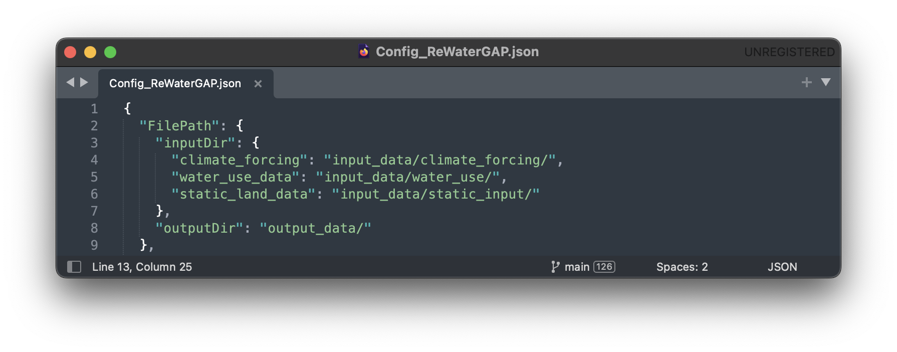
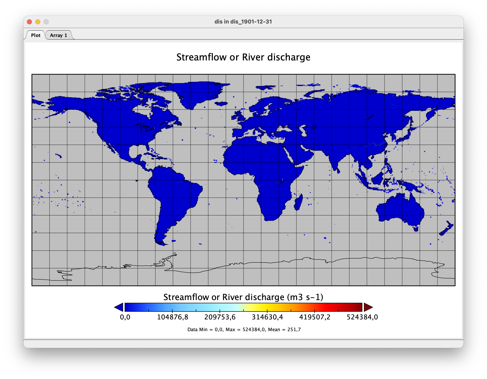

.. _tutorials:

############################
Tutorial (Under Development)
############################

.. contents:: 
    :depth: 4

.. note::
	Before following this tutorial, please follow the five minute guide found :ref:`here <five_minute_guide>`.

Running Water Gap with different simulation options (other model configurations)
================================================================================

Naturalized Run
***************

This simulation computes naturalized flows and storages that would occur if there were neither human water use nor global man-made reservoirs/regulated lakes.

To run Water Gap in a naturalized mode, see :ref:`here <naturalized_run>`.

Standard anthropogenic Run
**************************

The standard run in WaterGAP simulates the effects of both human water use and man-made reservoirs (including their commissioning years) on flows and storages.

In the example below, we will create a standard run for one year (1901) and go through the necessary steps step-by-step.

**Prerequisites:** You will need to clone WaterGAP and create an environment to run it in. If you haven't done so already follow the :ref:`five minute guide <five_minute_guide>` for this.

**1) Download the climate forcing data of your choice.**

In this example, we will be using the forcing "gswp3-w5e5_obsclim" from `ISIMIP <https://data.isimip.org/search/tree/ISIMIP3a/InputData/climate/atmosphere/gswp3-w5e5/obsclim/query//>`_ . The forcings from ISIMIP are sorted in groups of 10 years. We will be using the group of 1901 to 1910 as our example year of 1901 is in this group.
The forcings required are:

- precipitation [kg m-2 s-1]; `Link in ISIMIP <https://files.isimip.org/ISIMIP3a/InputData/climate/atmosphere/obsclim/global/daily/historical/GSWP3-W5E5/gswp3-w5e5_obsclim_pr_global_daily_1901_1910.nc>`_ 
- downward longwave radiation [Wm-2]; `Link in ISIMIP <https://files.isimip.org/ISIMIP3a/InputData/climate/atmosphere/obsclim/global/daily/historical/GSWP3-W5E5/gswp3-w5e5_obsclim_rlds_global_daily_1901_1910.nc>`_ 
- downward shortwave radiation [Wm-2]; `Link in ISIMIP <https://files.isimip.org/ISIMIP3a/InputData/climate/atmosphere/obsclim/global/daily/historical/GSWP3-W5E5/gswp3-w5e5_obsclim_rsds_global_daily_1901_1910.nc>`_ 
- temperature [K]; `Link in ISIMIP <https://files.isimip.org/ISIMIP3a/InputData/climate/atmosphere/obsclim/global/daily/historical/GSWP3-W5E5/gswp3-w5e5_obsclim_tas_global_daily_1901_1910.nc>`_ 

**2) Download the water use data.**

The forcings required are:

- potential consumptive use from irrigation using surface water :math:`[m3/month]`
- potential water withdrawal use from irrigation using surface water :math:`[m3/month]`
- potential net abstractions from surface water :math:`[m3/month]`
- potential net abstractions from groundwater :math:`[m3/month]`

Due to licensing, a download link will be made available at a later date. If you require the data, you may request a download link by sending us an `Email <mailto:Nyenah@em.uni-frankfurt.de>`_ .

**3) Place the downloaded data into their correct folders in the repository.**

In your WaterGAP repository, navigate to "input_data" and place the downloaded files for climate forcings and water use in their correct folders as seen in the picture below.

.. figure:: ../images/getting_started/input_data.png

**4) Modify the configuration file to set up a standard run.**

In your WaterGAP repository, navigate to "Config_ReWaterGAP.json". 

**4.1) File Paths**

The first options in the onfiguration file regard input and output file paths. In this example we will leave them unmodified.

**4.2) Runtime Options**

In the configuration file find the runtime options. Then find the simulation options. Set all options under "AntNat_opts" to "true". Set all options under "Demand_satisfaction_opts" to "true". 

.. figure:: ../images/getting_started/tutorials/runtime_options_standard_run.png

**4.3) Restart Options**

In this run, WaterGap will not restart from a previous state. Under "restart_options" make sure each option is set to "false".

**4.3) Simulation Period Options**

Next up the chosen timeframe for the simulation needs to be set. Under "SimulationPeriod" change the "start" date to "1901-01-01" and the "end" date to "1901-12-31".
For the reservoir operational years set the start and end years to "1901".

.. note::
	We will be using no spin-up years in this example. Usually, we will be simulating for a period of 5 years, with an additional 5-year spin-up.

.. figure:: ../images/getting_started/tutorials/simulation_period_options_standard_run.png

**4.4) Time step**

Under "time_step" leave the resolution set to "daily"

**4.5) Simulation Extend**

We will not be running WaterGAP for a basin in this example so leave the "run_basin" option under "SimulationExtent" set to "false".

**4.6) Output Variables**

Any number of variables may be written out. In this example, we will only want to write out the "streamflow" variable. Under "LateralWaterBalanceFluxes" find "streamflow" and set it to "true". Everything else should be set to "false". For a detailed explanation on which variables can be written out see the <glossary>.

**4.7) Save the configuration file**

**5) Run the simulation**

To run WaterGAP, use the following command in your terminal:

.. code-block:: bash

	$ python3 run_watergap.py Config_ReWaterGAP.json

In case of a problem find help in the `five minute guide <five_minute_guide>`_ .

If your run has been successful, your Terminal should look like this:

.. figure:: ../images/getting_started/tutorials/standard_run_successful.png

In your WaterGAP repository under "output_data" you will find a file named "dis_1901-12-31.nc". 

**6) Visualizing your results using Panopoly**

To visualize the output of this standard run we suggest using `Panopoly <https://www.giss.nasa.gov/tools/panoply/>`__. Download and install it. Then click on "file" -> "open". Navigate to your ReWaterGAP folder. Then to "output_data" and select the created file "dis_1901-12-31.nc". Click on "open".

You should now see your data set. Double-click the "dis" file in "Geo2D" format and click create.

Once you see a world map, labeled "Streamflow or River discharge" go to "Window" -> "Plot Controls" where you will see the time set to "1" of "365". By increasing the time you will see the River discharge change visually on the map.

.. _human_water_use_only:

Human Water Use only 
********************

This simulation includes human water use but excludes global man-made reservoirs/regulated lakes.

.. _reservoirs_only:

Reservoirs only
***************

This simulation excludes human water use but includes global man-made reservoirs/regulated lakes.

.. _restart_from_saved_state:

How to Restart WaterGap from saved state
========================================

Running WaterGAP with GWSWUSE (under development)
=================================================

