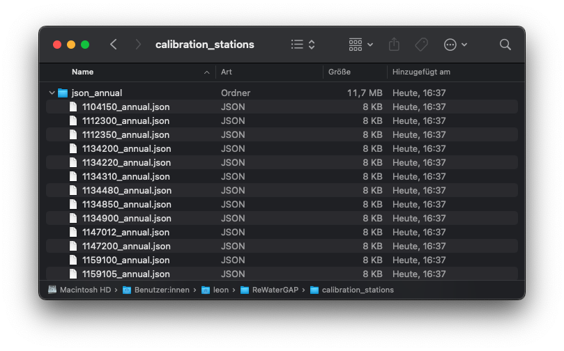

.. _tutorial_calibration:

############################################
Calibrate WaterGAP **(under development)**
############################################

.. contents:: 
    :depth: 3
    :backlinks: entry

********
Rational
********

WasterGAP is calibrated in a very simple basin-specific manner to match long-term mean annual observed streamflow at the outlet of 1509 drainage basins that cover ∼ 55 % of the global drainage area (except Antarctica and Greenland).

Calibration follows a four-step scheme with specific calibration status (CS) [1]_ [2]_ .

.. _calibration_schemes_definitions:

- **CS1**: Adjust the basin-wide uniform parameter gamma :math:`γ` (runoff coefficient) [1]_ in the range of [0.1–5.0] to match mean annual observed streamflow within ±1 %.
- **CS2**: Adjust :math:`γ` as for CS1 but within 10 % uncertainty range (90 %–110 % of observations).
- **CS3**: As for CS2 but apply the areal correction factor, CFA (adjusts runoff and, to conserve the mass balance, actual evapotranspiration as the counterpart of each grid cell within the range of [0.5–1.5]), to match mean annual observed streamflow with 10 % uncertainty.
- **CS4**: As for CS3 but apply the station correction factor, CFS (multiplies streamflow in the cell where the gauging station is located by an unconstrained factor), to match mean annual observed streamflow with 10 % uncertainty to avoid error propagate ion to the downstream basin.

.. note::
    For each basin, calibration steps 2–4 are only performed if the previous step was not successful.

****************************************************
Step-by-step guide to calibrating the WaterGAP model
****************************************************

Preparing climate and water use data 
####################################

See :ref:`tutorials <prepare_input_data>` on where to download climate forcing and water use data. 

Preparinging observed streamflow
################################

Download the observed streamflow data 
*************************************
The observed streamflow data can be downloaded from `zenodo <https://zenodo.org/records/7255968>`_ as a zip file. Download all files of the current version and unpack the zip file. You will find all necessary files as well as a readme.md file, which explains the content of the files.
The unzipped file contains files such as:

- "WaterGAP22e_cal_stat.shp" contains the location of the calibration stations as point-shapefile. 
- The ESRI shapefile "WaterGAP22e_cal_bas.shp"" contains the basin outlines of the calibration stations
- "json_annual", which contains the annual streamflows for 1509 stations.

In the downloaded and unzipped folder, unzip the "json_annual.zip" file. Move the unzipped folder to the location of your choice. In this tutorial we are creating a folder in the ReWaterGAP folder under "/Users/Username/ReWaterGAP/calibration_stations" and placing the "json_annual" folder there.

Edit the path in the configuration file
***************************************
In the WaterGAP Configuration file "Config_ReWaterGAP.json" navigate to "Calibrate WaterGAP". Under "path_to_observed_discharge" add the path to the "json_annual" folder you just saved and set "run_calib" to "true".

Modify the station file
#######################
Define the latitude and longitude coordinates of the station in the stations.csv (an example for all 1509 stations is given here "/ReWaterGAP/input_data/static_input/stations.csv"). To run a calibration for a specific basin, users can input the latitude and longitude values for stations within a specific basin.

Run the WaterGAP calibration
############################

To run the calibration scheme use this command:

.. code-block:: bash

    $ python3 run_calibration.py "location" "number of calibration regions"

- "location": "local" runs the program on your local server (default). "cluster" runs the program on high performing computer clusters (**will be implemented soon**).
- "number of calibration regions": Watergap groups all gauging stations into calibration regions, which are stations found in independent super basins. If "number of calibration regions" is set to 27, WaterGAP groups the 1509 stations into 27 calibration regions, which are run in parallel using 27 cores. If "number of calibration regions" is set to 1, it will run the entire calibration on one core, which is ill-adviced.

.. note::
    If you want to run the WaterGAP calibration on your local server for all 1509 station, we suggest you have at least 20 or more cores available, to enable faster runtimes.

To run watergap using the entire 1509 stations use this command:

.. code-block:: bash

    $ python3 run_calibration.py local 27

When you run the command the following steps are exctuted:

- **1:** Model is run with uncalibrated parameters to get actual net abstraction :math:`{NA}_{s}` and :math:`{NA}_{g}`. Here the parameter :math:`γ` is set to 2 for all calibration basins, CFA = 1 for all calibration basins and CFS = 1 for all stations.
- **2:** Calibration is performed using the scheme described above [link scheme above _calibration_schemes_definitions]. Please note that the stations provided standard in the stations.csv file [link station file csv]are used for calibration. For the standard calibration, all 1509 stations are used. The model setup for calibration is a standard anthropogenic run with the neigboring cell water supply option switched off [link tutorial for this].
- **3:** The calibrated γ values are regionalized to river basins without sufficient streamflow observations using a multiple linear regression approach that relates the natural logarithm of γ to basin descriptors (mean annual temperature, mean available soil water capacity, fraction of local and global lakes and wetlands, mean basin land surface slope, fraction of permanent snow and ice, aquifer-related groundwater recharge factor). [1]_ .

Modify the stations file
############################

References 
##########

.. [1] Müller Schmied, H., Cáceres, D., Eisner, S., Flörke, M., Herbert, C., Niemann, C., Peiris, T. A., Popat, E., Portmann, F. T., Reinecke, R., Schumacher, M., Shadkam, S., Telteu, C.E., Trautmann, T., & Döll, P. (2021). The global water resources and use model WaterGAP v2.2d: model description and evaluation. Geoscientific Model Development, 14(2), 1037–1079. https://doi.org/10.5194/gmd-14-1037-2021
.. [2] Müller Schmied, H., Trautmann, T., Ackermann, S., Cáceres, D., Flörke, M., Gerdener, H., Kynast, E., Peiris, T. A., Schiebener, L., Schumacher, M., and Döll, P.: The global water resources and use model WaterGAP v2.2e: description and evaluation of modifications and new features, Geosci. Model Dev. Discuss. [preprint], https://doi.org/10.5194/gmd-2023-213, in review, 2023.

