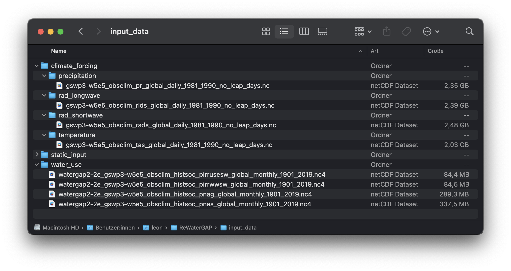
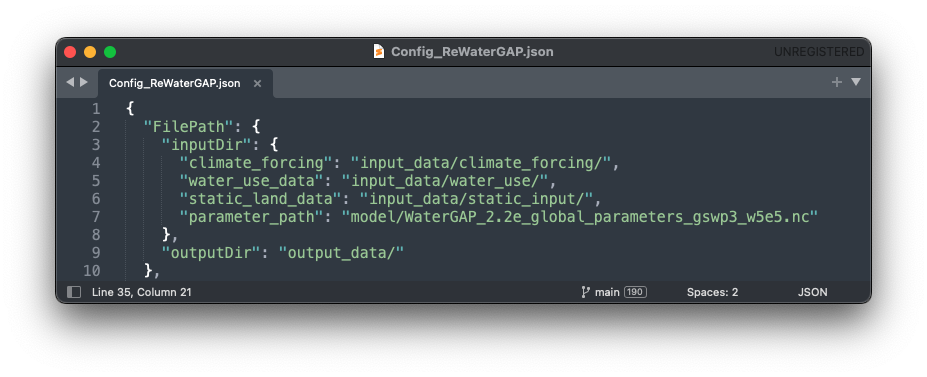
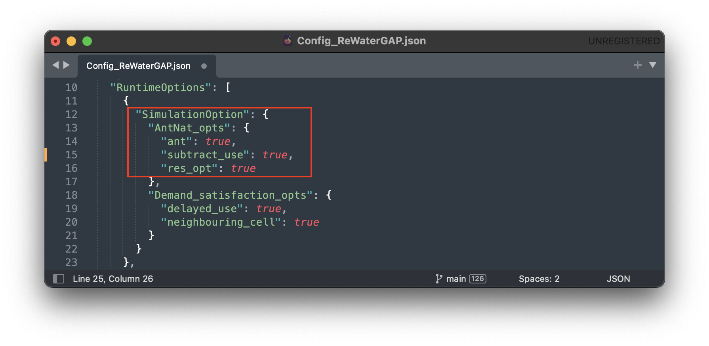
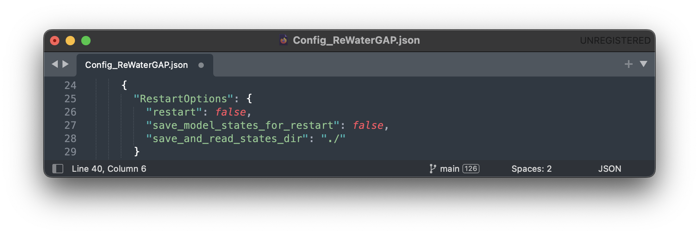
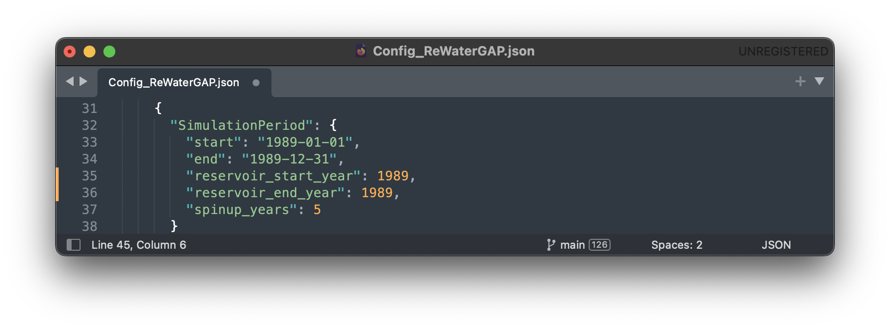
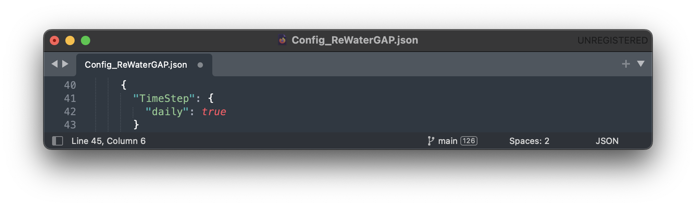
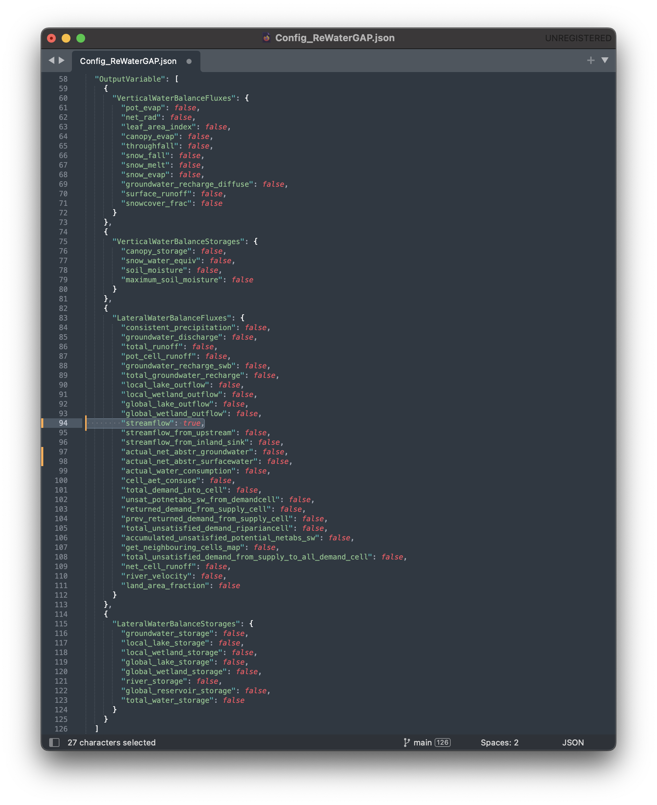
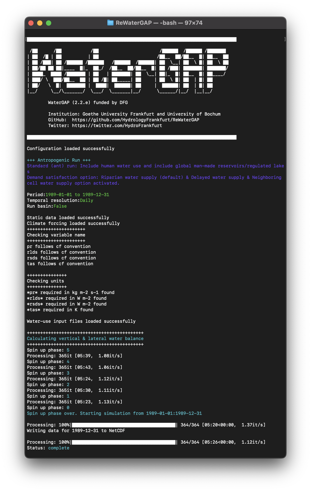
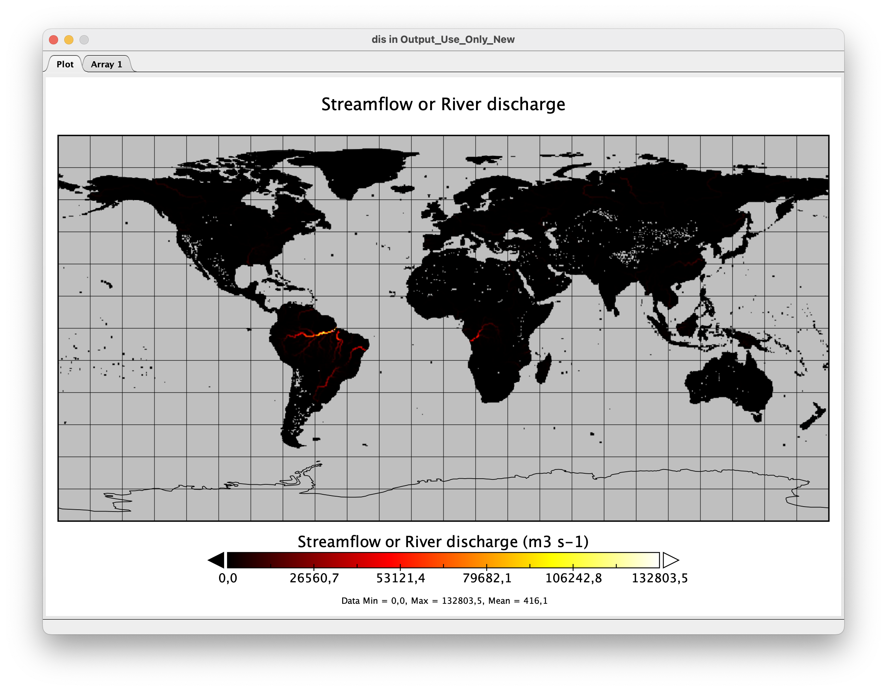
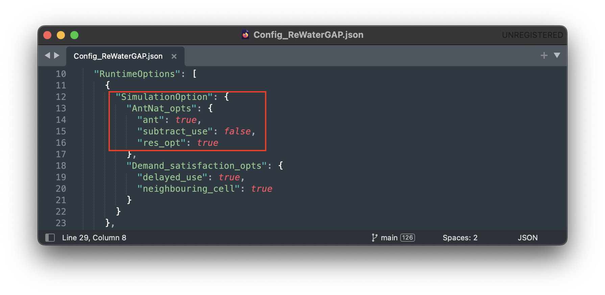

.. _tutorial_different_simulation_options:

################################################################################
Running WaterGAP with different simulation options (other model configurations)
################################################################################

.. contents:: 
    :depth: 3
    :backlinks: entry

Preparing Input Data
####################

.. _prepare_input_data:

In your WaterGAP repository you will find an **input_data** folder, which will hold all relevant climate forcings, water use data as well as static data needed to run the simulation. Throughout this tutorial we will be running the simulation for the year 1989.

Climate input data set for GSWP3-W5E5, 20CRv3-W5E5, and 20CRv3-ERA5 can be downloaded from `ISIMIP <https://data.isimip.org/search/tree/ISIMIP3a/InputData/climate/atmosphere/>`_ .  
The climate forcing GSWP3-ERA5 is no longer available on ISIMIP, but is available on the Goethe University Frankfurt data repository.

- `Climate forcing GSWP3-ERA5 <https://doi.org/10.25716/GUDE.0H3E-SBWV>`_ [1]_

Corresponding water use data is available from the Goethe University Frankfurt data repository:

- `Water use input with GSWP3-W5E5 climate forcing <https://doi.org/10.25716/GUDE.0296-3FD7>`_ [2]_
- `Water use input with 20CRv3-W5E5 climate forcing <https://doi.org/10.25716/GUDE.0H6A-SR8Q>`_ [3]_
- `Water use input with 20CRv3-ERA5 climate forcing <https://doi.org/10.25716/GUDE.1BGX-87AA>`_ [4]_
- `Water use input with GSWP3-ERA5 climate forcing <https://doi.org/10.25716/GUDE.1VNN-DYCV>`_ [5]_

1) Download the climate forcing data of your choice.
******************************************************

To begin running WaterGAP we must download the necessary climate forcing data. In the following examples, we will be using the forcing "gswp3-w5e5_obsclim" from `ISIMIP <https://data.isimip.org/search/tree/ISIMIP3a/InputData/climate/atmosphere/gswp3-w5e5/obsclim/query//>`_ . 

The forcings from ISIMIP are sorted in groups of 10 years. We will be using the group of 1981 to 1990 as our example year of 1989 is in this group.
The forcings required are:

- precipitation [kg m-2 s-1]; `Link in ISIMIP <https://files.isimip.org/ISIMIP3a/InputData/climate/atmosphere/obsclim/global/daily/historical/GSWP3-W5E5/gswp3-w5e5_obsclim_pr_global_daily_1981_1990.nc>`_ 
- downward longwave radiation [Wm-2]; `Link in ISIMIP <https://files.isimip.org/ISIMIP3a/InputData/climate/atmosphere/obsclim/global/daily/historical/GSWP3-W5E5/gswp3-w5e5_obsclim_rlds_global_daily_1981_1990.nc>`_ 
- downward shortwave radiation [Wm-2]; `Link in ISIMIP <https://files.isimip.org/ISIMIP3a/InputData/climate/atmosphere/obsclim/global/daily/historical/GSWP3-W5E5/gswp3-w5e5_obsclim_rsds_global_daily_1981_1990.nc>`_ 
- temperature [K]; `Link in ISIMIP <https://files.isimip.org/ISIMIP3a/InputData/climate/atmosphere/obsclim/global/daily/historical/GSWP3-W5E5/gswp3-w5e5_obsclim_tas_global_daily_1981_1990.nc>`_ 

.. note::
	Make sure to remove the leap days (29th February) from the climate forcings if you are running the simulation for a leap year (WaterGap does not consider leap days).

2) Download the water use data
******************************

Next up we will need to download the necessary water use data. In the following examples, we will be using the forcing "gswp3-w5e5_obsclim" from the Goethe University Frankfurt.

The forcings required are:

- potential consumptive use from irrigation using surface water :math:`[m3/month]`
- potential water withdrawal use from irrigation using surface water :math:`[m3/month]`
- potential net abstractions from surface water :math:`[m3/month]`
- potential net abstractions from groundwater :math:`[m3/month]`

In the following tutorials we will be using data provided by Müller Schmied, H. and Nyenah, E. via the Goethe University Frankfurt which can be downloaded `here <https://doi.org/10.25716/GUDE.0296-3FD7>`_. In this data leap days have already been removed.

3) Place the downloaded data into their correct folders in the repository
*************************************************************************

Once your climate forcing and water use data has finished downloading, in your WaterGAP repository, navigate to "input_data" and place the downloaded files in their correct folders as seen in the picture below:

.. _naturalized_run:

Naturalized Run
###############

This simulation computes naturalized flows and storages that would occur if there were neither human water use nor global man-made reservoirs/regulated lakes.

To run WaterGAP in a naturalized mode, find the tutorial in the :ref:`five minute guide here <five_minute_guide>`.

.. _standard_anthropogenic_run:

Standard anthropogenic Run
##########################

The standard run in WaterGAP simulates the effects of both human water use and man-made reservoirs (including their commissioning years) on flows and storages.

In the example below, we will create a standard run for one year (1989) and go through the necessary steps, step-by-step.

**Prerequisites:** You will need to clone WaterGAP and create an environment to run it in. If you haven't done so already follow the :ref:`five minute guide <five_minute_guide_naturalized_run>` for this.

1) Prepare the input data
***************************

Download all required climate forcing and water use data, remove all leap days, and place the data in the "input_data" folder in your ReWaterGAP repository as explained :ref:`above <prepare_input_data>`.

.. _modify_the_configuration_file_tutorial:

2) Set up the configuration file
*********************************

WaterGAP can be setup for your specific usecase. In the following we will be going through the various configuration options as well as the available output options and configuring the simulation for a standard anthropogenic run without restart. For a detailed description on the possible settings see our :ref:`guide to the configuration file <configuration_file>`.

To configure WaterGAP, go to your WaterGAP repository and navigate to "Config_ReWaterGAP.json" and open the configuration file. 

**2.1) File Paths**

The first options in the configuration file regard input and output file paths. In this example, we will leave them unmodified. The locations for input and output data can be seen in the picture below.

**2.2) Runtime Options**

In the configuration file find the runtime options. Then find the simulation options. Set all options under "AntNat_opts" to "true" and all options under "Demand_satisfaction_opts" to "true" to set up a standard anthropogenic run.

**2.3) Restart Options**

In this run, WaterGap will not restart from a previous state. Under "restart_options" make sure each option is set to "false".

To find more information on restart options find a tutorial on how to save and restart WaterGAP :ref:`here <restart_from_saved_state>`.

**2.4) Simulation Period Options**

In this example we are running the simulation for the year 1989. Under "SimulationPeriod" change the "start" date to "1989-01-01" and the "end" date to "1989-12-31".
For the reservoir operational years set the start and end years to "1989". 

We will be using a five year spin-up period in this example. Set "spinup_years" to "5".

**2.5) Time step**

Under "time_step" set the resolution to "daily".

**2.6) Simulation Extend**

We will not be running WaterGAP for a basin in this example so set the "run_basin" option under "SimulationExtent" to "false".

**2.7) Output Variables**

Any number of variables may be written out. In this example, we will only write out the "streamflow" variable. Under "LateralWaterBalanceFluxes" find "streamflow" and set it to "true". Everything else should be set to "false". For a detailed explanation on which variables can be written out see the :ref:`glossary <glossary>`.

**2.8) Save the configuration file**

Save the configuration file

3) Run the simulation
*********************

Navigate to your ReWaterGAP folder in the terminal, activate your environment, and run WaterGAP using the following command:

.. code-block:: bash

	$ python3 run_watergap.py Config_ReWaterGAP.json

In case of a problem find help in the :ref:`five minute guide <five_minute_guide>`.

If your run has been successful, your Terminal should look like this:

In your WaterGAP repository under "output_data" you will find a file named "dis_1989-12-31.nc". 

.. _visualizeing_results:

4) Visualize your results
*************************

To visualize the output of any given simulation we suggest using `Panopoly <https://www.giss.nasa.gov/tools/panoply/>`__. You can use it to open the input files in NetCDF format or your output files after the simulation has finished running. 

To visualize the streamflow results from this tutorial, first navigate to your ReWaterGAP folder. Then to "output_data" and select the created file "dis_1989-01-01.nc". Open Panopoly and drag and drop the file into it. Then click on the Geo2D file in panopoly to open the map.

The result should look like this:

.. _human_water_use_only:

Human Water Use only 
####################

This simulation includes human water use but excludes global man-made reservoirs/regulated lakes. When creating a human-water-use-only run, the setup follows the standard run in all but one step. In the example below, we will create a human-water-use-only run for one year (1989) and go through the steps step-by-step.

**Prerequisites:** You will need to clone WaterGAP and create an environment to run it in. If you haven't done so, follow the :ref:`five minute guide <five_minute_guide>` for this.

1) Prepare the input data.
********************************

Download all required climate forcing and water use data, remove all leap days, and place the data in the "input_data" folder in your ReWaterGAP repository as explained :ref:`above <prepare_input_data>`.

2) Set up the configuration file
********************************

The only difference between a standard and a human-water-use-only run are the simulation options. In your configuration file, under "SimulationOption" find “AntNat_opts”. Set "ant" to "true," "subtract_use" to "true" and "res_opt" to "false" as seen in the picture :ref:`below <use_only_run_example_picture>`.

.. _use_only_run_example_picture:

.. figure:: ../../images/user_guide/tutorial/runtime_options_use_only_run.png

Set up File Paths, other Runtime Options, Restart Options, Simulation Period Options, Time step, Simulation Extend and Output Variables as described :ref:`above <modify_the_configuration_file_tutorial>` and save it.

3) Run the simulation
********************************

Navigate to your ReWaterGAP folder in the terminal, activate your environment, and run WaterGAP using the following command:

.. code-block:: bash

	$ python3 run_watergap.py Config_ReWaterGAP.json

In case of a problem find help in the :ref:`five minute guide <five_minute_guide>`.

In your WaterGAP repository under "output_data" you will find a file named "dis_1989-12-31.nc".  

4) Visualize your results
********************************

To visualize the output of any given simulation we suggest using `Panopoly <https://www.giss.nasa.gov/tools/panoply/>`_. For more detals see :ref:`above <visualizeing_results>`.

For the year 1989-01-01 the result should look like this:

.. _reservoirs_only:

Reservoirs only
###############

This simulation excludes human water use but includes global man-made reservoirs/regulated lakes. When creating a reservoirs-only run, the setup follows the standard run in all but one step. In the example below, we will create a reservoirs-only run for one year (1989) and go through the steps step-by-step.

**Prerequisites:** You will need to clone WaterGAP and create an environment to run it in. If you haven't done so, follow the :ref:`five minute guide <five_minute_guide>` for this.

1) Prepare the input data.
********************************

Download all required climate forcing and water use data, remove all leap days, and place the data in the "input_data" folder in your ReWaterGAP repository as explained :ref:`above <prepare_input_data>`.

2) Set up the configuration file
********************************

The only difference between a standard and a reservoirs-only run are the simulation options. In your configuration file, under "SimulationOption" find “AntNat_opts”. Set "ant" to "true," "subtract_use" to "false" and "res_opt" to "true" as seen in the picture :ref:`below <reservoirs_only_run_example_picture>`.

.. _reservoirs_only_run_example_picture:

Set up File Paths, other Runtime Options, Restart Options, Simulation Period Options, Time step, Simulation Extend and Output Variables as described :ref:`above <modify_the_configuration_file_tutorial>` and save it.

3) Run the simulation
********************************

Navigate to your ReWaterGAP folder in the terminal, activate your environment, and run WaterGAP using the following command:

.. code-block:: bash

	$ python3 run_watergap.py Config_ReWaterGAP.json

In case of a problem find help in the :ref:`five minute guide <five_minute_guide>`.

In your WaterGAP repository under "output_data" you will find a file named "dis_1989-12-31.nc".  

4) Visualizing your results using Panopoly
************************************************

To visualize the output of any given simulation we suggest using `Panopoly <https://www.giss.nasa.gov/tools/panoply/>`_. For more detals see :ref:`above <visualizeing_results>`.

For the year 1989-01-01 the result should look like this:

**********
References 
**********

.. [1] Müller Schmied, H. and Nyenah, E.: Climate forcing GSWP3-ERA5 as input for the global hydrological model WaterGAP, https://doi.org/10.25716/GUDE.0H3E-SBWV, 19 June 2024a.

.. [2] Müller Schmied, H. and Nyenah, E.: Water use input for WaterGAP Global Hydrological Model (Python version) and GSWP3-W5E5 climate forcing under historical setup of direct human impacts, https://doi.org/10.25716/GUDE.0296-3FD7, 19 June 2024e.

.. [3] Müller Schmied, H. and Nyenah, E.: Water use input for WaterGAP Global Hydrological Model (Python version) and 20CRv3-W5E5 climate forcing under historical setup of direct human impacts, https://doi.org/10.25716/GUDE.0H6A-SR8Q, 19 June 2024c.

.. [4] Müller Schmied, H. and Nyenah, E.: Water use input for WaterGAP Global Hydrological Model (Python version) and 20CRv3-ERA5 climate forcing under historical setup of direct human impacts, https://doi.org/10.25716/GUDE.1BGX-87AA, 19 June 2024b.

.. [5] Müller Schmied, H. and Nyenah, E.: Water use input for WaterGAP Global Hydrological Model (Python version) and GSWP3-ERA5 climate forcing under historical setup of direct human impacts, https://doi.org/10.25716/GUDE.1VNN-DYCV, 19 June 2024d.

