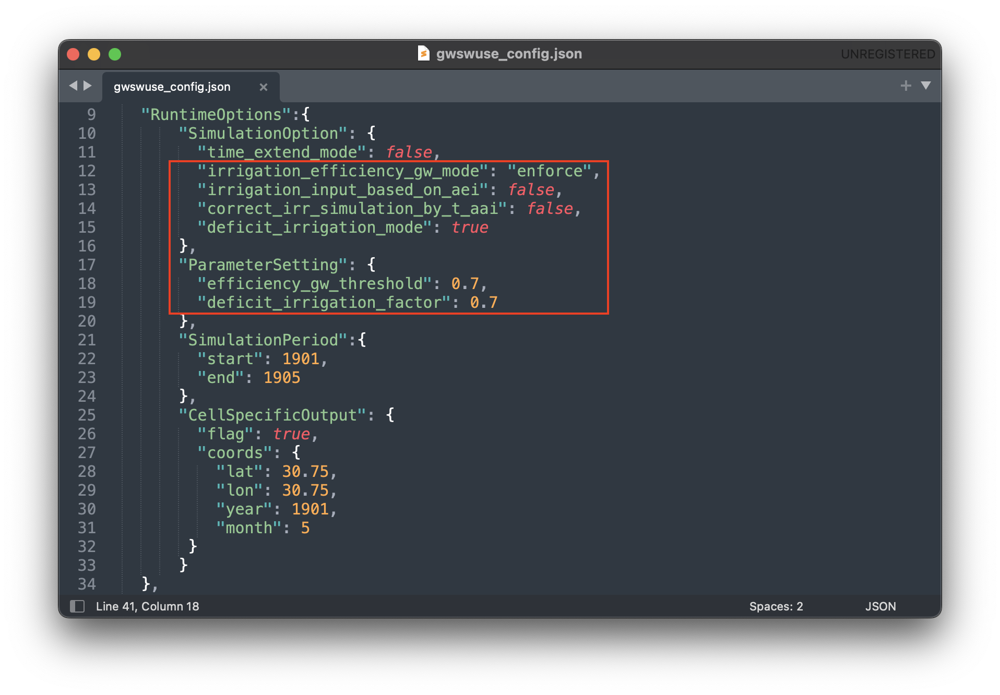

.. _tutorial_gwswuse:

#############################################
Run WaterGAP with GWSWUSE (under development)
#############################################

.. contents:: 
    :depth: 3
    :backlinks: entry

************
Installation
************

.. _installation_guide_gwswuse:

Installation Steps
##################

Follow these steps to to install ReGWSWUSE:

Install Python and download libraries
*************************************

Download the latest version of Python from the official Python website and install it if Python is not already installed on your system.

Clone the reGWSWUSE repository
******************************

Using the Terminal, navigate to the directory of choice where the ReGWSWUSE folder will be copied into. Then use the following command to clone the repository.

.. code-block:: bash

		$ git clone https://github.com/HydrologyFrankfurt/ReGWSWUSE

Find more information in the official GitHub documentation `here <https://docs.github.com/en/get-started/quickstart/fork-a-repo#cloning-your-forked-repository>`__ .

Create an environment to run ReGWSWUSE in
******************************************

Navigate to the ReGWSWUSE folder in the terminal using the following command.

.. code-block:: bash

	$ cd user/…/ReGWSWUSE
	

Create an environment (e.g. with the name "regwswuse") and install the required packages from the requirements.txt file by running the following command.

.. code-block:: bash

	example

	$ mamba create --name regwswuse --file requirements.txt

Activate the ReGWSWUSE environment using the following command.

.. code-block:: bash

	example

	$ mamba activate regwswuse

Preparing the Input Data
########################

Input data must be located in a specified folder path indicated in the configuration file, following a defined directory structure. The structure of the input folder is precisely defined in the convention file (`gwswuse_convention`). It is based on a hierarchical organization by sectors and variables:

- **Sector Requirements**: The sector names in the convention file specify which sector subfolders must be searched in the input data path. For example, the subfolder `irrigation` corresponds to the irrigation sector, while `domestic` refers to the household sector.
  
- **Expected Variables**: The expected variables specify from which variable subfolders within each sector NetCDF files should be read. These subfolders represent specific data categories, such as `consumptive_use_tot` (total consumptive water use), `fraction_gw_use` (fraction of consumptive groundwater use), etc.

When the data is placed in the input_data folder correctly, it will look like this:

.. figure:: ../../images/user_guide/tutorial/input_data_gwswuse.png

Required Data for GWSWUSE Execution in WaterGAP-2.2e Mode
*********************************************************

**Irrigation**:

- `consumptive_use_tot`: [m³/month], monthly data (monthly potential irrigation consumptive water use)
- `fraction_gw_use`: [-], time-invariant (potential irrigation fraction of groundwater use)
- `fraction_return_gw`: [-], time-invariant (potential irrigation fraction of return flow to groundwater)
- `irrigation_efficiency_sw`: [-], time-invariant (Irrigation efficiency for surface water abstraction infrastructure)
- `gwd_mask`: [boolean], time-invariant (mask for groundwater depletion due to human water use greater than 5 mm/yr average for 1980–2009)
- `abstraction_irr_part_mask`: [boolean], time-invariant (mask for irrigation part of water abstraction greater than 5% during 1960–2000)

**Domestic**:

- `consumptive_use_tot`: [m³/year], yearly data (yearly potential domestic consumptive water use)
- `abstraction_tot`: [m³/year], yearly data (yearly potential domestic water abstraction)
- `fraction_gw_use`: [-], time-invariant (potential domestic fraction of groundwater use)

**Manufacturing**:
	
- `consumptive_use_tot`: [m³/year], yearly data (yearly potential manufacturing consumptive water use)
- `abstraction_tot`: [m³/year], yearly data (yearly potential manufacturing water abstraction)
- `fraction_gw_use`: [-], time-invariant (potential manufacturing fraction of groundwater use)

**Thermal Power**:

- `consumptive_use_tot`: [m³/year], yearly data (yearly potential thermal power consumptive water use)
- `abstraction_tot`: [m³/year], yearly data (yearly potential thermal power water abstraction)

**Livestock**:

- `consumptive_use_tot`: [m³/year], yearly data (yearly potential livestock consumptive water use)

Additional Required Input Data for Other Configuration Settings
***************************************************************

If other configuration options are set, additional input data will be required, specifically for the irrigation sector:

**Irrigation**:

- `fraction_aai_aei`: [-], monthly data (fraction of areas actually irrigated to areas equipped for irrigation for 1901-2020)
- `time_factor_aai`: [-], monthly data (temporal development factor of national areas actually irrigated for 2016-2020 relative to 2015)

Optional Input Data
*******************

For the sectors domestic, manufacturing, livestock, and thermal power, sector-specific `fraction_gw_use` and `fraction_return_gw` can also be provided as optional input data. This requires the creation of a variable folder within the respective sector subfolders and placing the corresponding netCDF file in that folder.

Configuration (`gwswuse_config.json`)
**************************************
To start GWSWUSE in WaterGap-2.2e mode, the configuration file must be edited in the following ways, as seen in the picture below.

- "*irrigation_efficiency_gw_mode*": "enforce"
- "*irrigation_input_based_on_aei*": "false"
- "*correct_irr_simulation_by_t_aai*": "false"
- "*deficit_irrigation_mode*": "true" 
- "*efficiency_gw_threshold*": "0.7"
- "*deficit_irrigation_factor*": "0.7"

For further information on the configuration file and all options, which may be changed within, find the guide to the configuration file :ref:`here <configuration_file_gwswuse>`.

Running the Software
####################

The simulation in ReGWSWUSE is executed via the main program `run_regwswuse.py`. This script manages the entire simulation process and ensures that all modules and functions are called and executed in the correct order. This chapter explains how the main script works and how to use it to run the simulation.

Before you run the simulation, make sure the previously described steps have been completed.
	- **Installation Completed**: Ensure that ReGWSWUSE has been successfully installed per the installation instructions (see Chapter 2.2).
	- **Configuration File preparation**: Prepare the JSON configuration file containing all necessary settings for your simulation. This file should define paths to input data, the simulation period, specific simulation options, and output directories (see the "Configuration Module and File" chapter). Save the configuration file in the same directory as `run_regwswuse.py`.
	- **Input Data preparation**: Ensure that the folder specified by `cm.input_data_path` in the configuration file is populated with the required input files. These files must meet the requirements set forth in the convention file (`gwswuse_convention`), including correct structure, variable names, units, and required spatial and temporal coverage.

Main Program Execution
**********************

Once the installation is complete and the configuration file is prepared, the software can be executed. For this open a terminal, navigate to the directory containing the ReGWSWUSE files and use the following command to run ReGWSWUSE with the configuration file:

.. code-block:: bash

	$python run_regwswuse.py --config <path_to_config_file>

Checking Execution
******************

**Console Output**:

During execution, the software will output progress and important information to the console. Pay attention to any error messages or indications that adjustments may be needed. 

**Result Storage**:

The results will be saved in the output folder defined in the configuration file (`cm.output_dir`) and can subsequently be analyzed.

By flexibly adjusting the configuration file and using the main script `run_regwswuse.py` with the specified configuration file, you can adapt the simulation to a variety of scenarios and requirements, making ReGWSWUSE a versatile tool for modeling water use.
