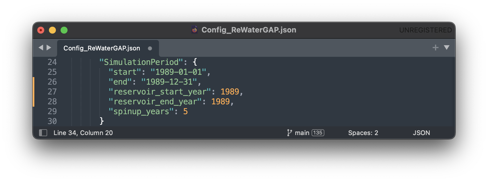
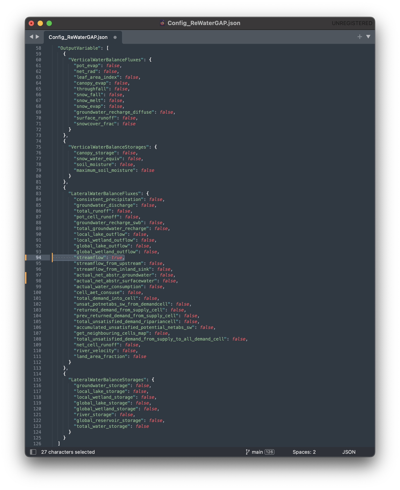
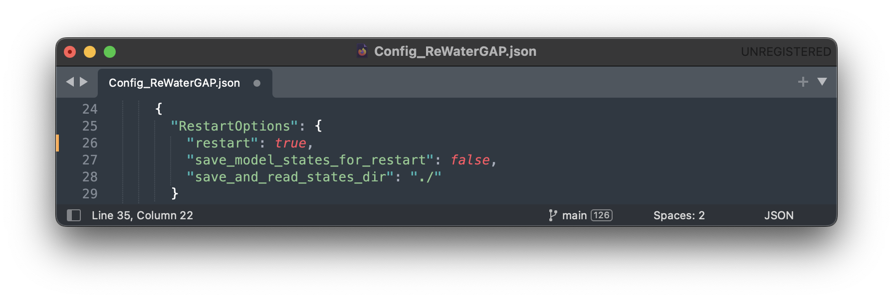
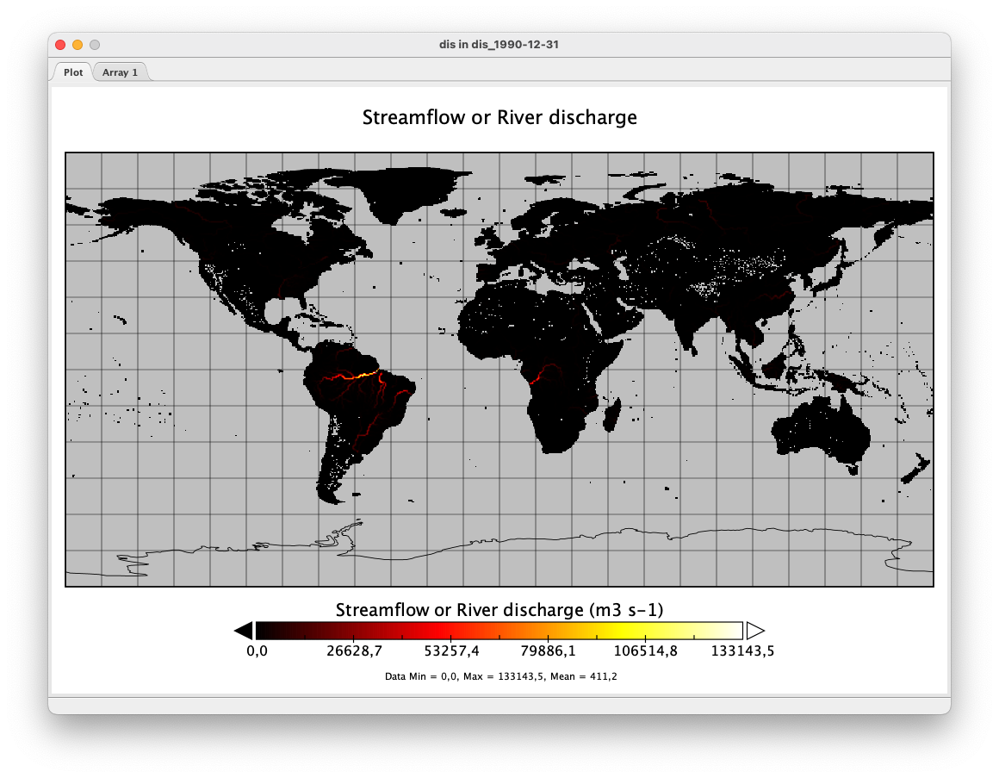

.. _tutorial_restarting_saved_states:

Restart WaterGAP from a prescribed initial condition (saved state)
##################################################################

To run Watergap from a saved state, you must first save data from a previous simulation. In this tutorial, we will be looking at the previous example, where we ran the simulation for a :ref:`standard anthropogenic run <standard_anthropogenic_run>` for the year 1989, create a saved state, and then restart the simulation from this data to continue running for 1990.

.. _creating_a_saved_state:

Creating a saved state
######################

Restarting the simulation works for any of the simulation options (:ref:`Standard Run <standard_anthropogenic_run>`, :ref:`Naturalized Run <naturalized_run>`, :ref:`Human Water Use <human_water_use_only>` and :ref:`Reservoirs only <reservoirs_only>`). In this example, we will be creating a saved state for a :ref:`standard anthropogenic run <standard_anthropogenic_run>`.

Before running the simulation we have to modify the configuration file. In your WaterGAP repository, navigate to "**Config_ReWaterGAP.json**". Under "**RestartOptions**", set "**restart**" to "false" and "**save_model_states_for_restart**" to "true", as this is the run we will be creating the saved state from. On your computer create a folder to save the saved state data in. In this example, we will be using a folder under "Users/username/restart_data". In your configuration file, set "**save_and_read_states_dir**" to the created directory, as shown in the `image below <saving_for_restart>`_ .

.. _saving_for_restart:

.. figure:: ../../images/user_guide/tutorial/restart_options_saving.png

Then set your "**SimulationPeriod**" to the preferred year (In this example 1989) and the "**spinup_years**" to 5.

All other options and steps to run the simulation will remain as they are described under `standard anthropogenic run <standard_anthropogenic_run>`_.

Run the simulation. You will then find your saved state data file "restartwatergap_1989-12-31.pickle" in your saved state directory (in this example under "Users/username/restart_data").

.. figure:: ../../images/user_guide/tutorial/restart_options_output_file.png

.. _restart_from_saved_state:

Running the simulation from saved data
########################################

In this step we will be running the simulation from the previously saved state, for the year 1990, starting one day after the last day saved in the saved state. It is possible to run the simulation for any time period even beyond the one year used here.

To run the simulation from a previously saved state go to the configuration file and navigate to "**RestartOptions**". Set **restart** to "true" and "**save_model_states_for_restart**" to "false", as this is the run we will be using the saved data for. Under "**save_and_read_states_dir**" set the path to the previously created directory holding your saved data (in this example under "Users/username/restart_data").

When we created the saved data we ran the simulation for the year 1989, with a five year spin up. Since this is our saved data, when running the simulation from this saved state we can only run it starting the day after. Here, we will be running the simulation for the year 1990, starting one day after the saved state data ends and without a spin up, as the saved state already includes this data.

All other options will remain as they are described under :ref:`creating a saved state <creating_a_saved_state>`.

.. figure:: ../../images/user_guide/tutorial/restart_options_simulation_period_after.png

Lastly, run the simulation with these options. To verify that everything is running as intended, you should receive this message in the terminal:

.. figure:: ../../images/user_guide/tutorial/restart_options_terminal_restart_run_successful.png

Visualize your results
**********************

To visualize the output of any given simulation we suggest using `Panopoly <https://www.giss.nasa.gov/tools/panoply/>`_. For more detals see :ref:`here <visualizeing_results>`.

For the period 1990-01-01 the result should look like this:

