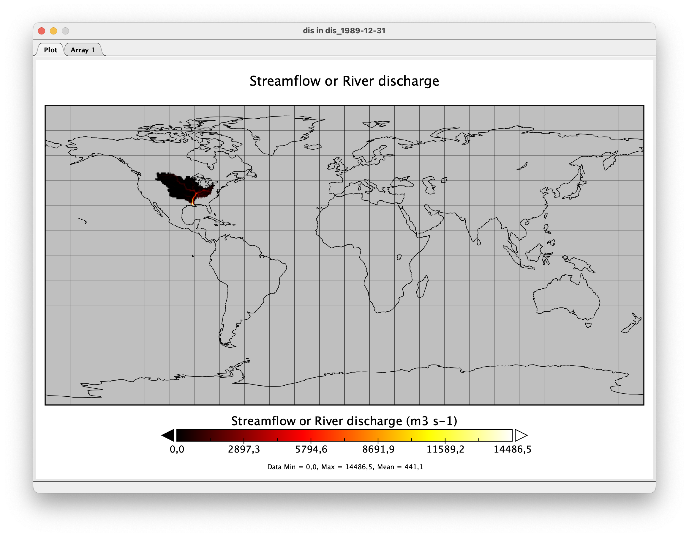

.. _tutorial_specific_basin:

#####################################
Run WaterGap for a specific basin
#####################################

In the example below, we will run WaterGap with a :ref:`standard run configuration <standard_anthropogenic_run>` for one year (1989) for the Mississippi basin.

Follow the standard run instructions for preparring the input data and setting up the configuration file from steps 2.1 through 2.5 :ref:`here <standard_anthropogenic_run>`. Then, as an additional step set the "SimulationExtend" under "run_basin" to "true" in the configuration file.

.. figure:: ../../images/user_guide/tutorial/run_basin_true.png

We will only write out the “streamflow” variable. Under “LateralWaterBalanceFluxes” find “streamflow” and set it to “true”. Everything else should be set to “false”. For a detailed explanation on which variables can be written out see the glossary. Then save the configuration file.

If "run_basin" is set to "true" you need to modify a station.csv. By default, the stations.csv file is located under "input_data/static_input/". This path can be changed in the configuration file under "path_to_stations_file".

Define the basin in the stations.csv file basesd on the latitude and longitude coordinates of the downstream cells. Watergap automatically computes corresponding upstream cells, for the downstream cells you manually specified. An example "stations.csv" file is shown for the Mississippi basin is located at the default path "input_data/static_input/stations.csv". You can have a look to see what the file contains there.

Lastly, run the command below to start WaterGAP:

.. code-block:: bash

	$ python3 run_watergap.py Config_ReWaterGAP.json

Visualize your results
**********************

To visualize the output of any given simulation we suggest using `Panopoly <https://www.giss.nasa.gov/tools/panoply/>`_. For more detals see :ref:`here <visualizeing_results>`.

For the year 1989-01-01 and the Mississippi basin the result should look like this:

